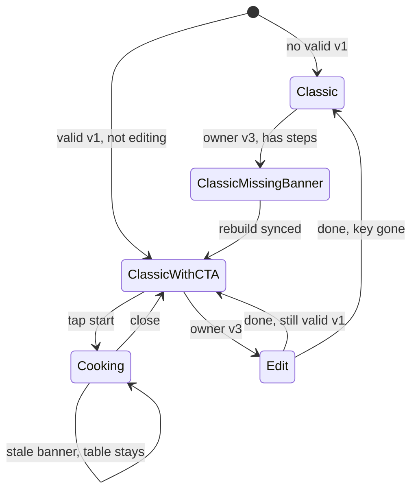

# Data model: 074 process-table

Канон JSON: [contracts/process-table-v1.schema.json](./contracts/process-table-v1.schema.json) (= web). Native не пишет таблицу, только читает и считает хеш.

## ProcessTableV1

| Поле | Тип | Правила |
|------|-----|---------|
| `version` | Int | строго `1`, иначе весь объект invalid |
| `sourceHash` | String | 64 hex `[a-f0-9]` |
| `columns` | [ProcessTableColumn] | ≥1 после серверного sanitize; native не drop-ит колонки |
| `assignments` | [ProcessTableAssignment] | ≥1 |
| `rowOrder` | [String]? | permutation id; лишнее ignore; недостающее — document order |
| `cellTitles` | [ProcessTableCellTitle]? | |

Decode fail (битый JSON, не object, version ≠ 1, нет required) → `decoded = nil`, **raw string остаётся**.

## ProcessTableColumn

`id` (UUID lowercase), `title` (non-empty), `kind`: `prep` \| `cook`, `stepIndex`: Int? (≥0 или null).

## ProcessTableAssignment

`ingredientId`, `columnId` (UUID колонки в stored JSON, не индекс LLM).

## ProcessTableCellTitle

`ingredientId`, `columnId`, `title`.

## RecipeData

Добавить `processTableRaw: String?`. Writer full-replace MUST копировать. Не парсить в `RecipeData` инициализаторе тяжело — decode в codec/helper, UI читает `ProcessTableV1?`.

## CookingSession (in-memory)

| Поле | Смысл |
|------|--------|
| `recipeId` | captured identity |
| `checkedIngredientIds` | «отмерял» |
| `checkedCellKeys` | `{startIngredientId}:{columnId}` span |
| `didEnableAwakeForSession` | чтобы restore тоггла карточки |

Не Codable persist. Teardown: dismiss, logout, account switch, kill.

## StaleState

`currentHash = hash(ingredients + descriptionHtml)`. `isStale = decoded != nil && decoded.sourceHash != currentHash`. `canRebuild = isOwner && isOnline && !isPublicReadonly`.

## ProcessTableMatrixViewModel (pure)

Вход: `ProcessTableV1` + `[IngredientData]` + `scaleFactor` + `descriptionHtml` + session checks.

Выход: `prepColumns`, `cookColumns`, `rows` (ordered, non-separator, drop unknown ids, include new ingredients with empty cells), `spans[columnId]`, `timerChipsByColumn`, `leftoverTimerChips`.

Не мутирует Yjs.

## State transitions

Classic missing: owner v3 видит not-built баннер. Discover / v1–v2 остаются в `Classic` без баннера.
