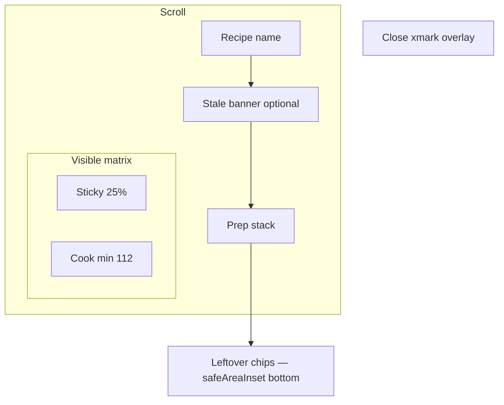

# Layout: Таблица процесса (cooking matrix)

**Spec**: [spec.md](./spec.md)  
**Figma**: нет — **формат матрицы**: web `process-table.tsx` + [RecipeTables](https://recipetables.com). **Chrome / ориентация: iOS HIG**, не web overlay/split и не «поворот картинки».  
**Аудит**: [layout-audit.json](./layout-audit.json) · `bash scripts/audit-ui-layout.sh specs/074-process-table`

> Черновик для **ревью человеком** перед реализацией view. После согласования — источник истины для приёмки. Static audit ≠ acceptance.

---

## Canvas

### Карточка рецепта — точка входа

Тот же холст, что `YDocRecipeDetailView` / `DiscoverRecipeView`. Toolbar не трогаем (share / awake / edit).

CTA **в одной строке с заголовком секции шагов**, справа:

```text
HStack(alignment: .center, spacing: 8)
├─ заголовок шагов     leading, 1 line, truncate  (layoutPriority low)
└─ «Начать готовить»   trailing, hugs content      (layoutPriority high)
    hit ≥ 44 × 44, не full-width
```

Заголовок — тот же, что у секции (`StepsSection`: сейчас «Instructions» / пользователь называет «Шаги»). Кнопка не вторая строка и не блок между nutrition и steps.

| Параметр | Значение |
|----------|----------|
| Горизонтальные insets | как у заголовка `StepsSection` (сейчас `.padding(.horizontal)` = 16) |
| Высота ряда | ≥ 44 pt (hit кнопки); заголовок по центру ряда |
| Кнопка | `.borderless`, accent, `.appBody()`, hug; не занимает ширину заголовка |
| Нет таблицы / edit | только заголовок, как сегодня |

**Критично:** заголовок **не** сжимается в колонку кнопки. Кнопка полностью видна; длинный RU «Начать готовить» не переносится под «Шаги». На SE 375: «Шаги» + кнопка влезают в одну строку; если нет — truncate **заголовка**, не кнопки.

### Готовка iPhone — системный landscape

Не web overlay на всё окно и не `rotationEffect`. Экран готовки — обычный iOS landscape:

1. `fullScreenCover` (не push, не sheet). Без системного navigation bar: заголовок рецепта в скролле, Close — overlay `xmark` в правом верхнем углу (hit 44, `common.close`).
2. `requestGeometryUpdate(.landscape)` — система крутит **окно** (status bar, safe area, home indicator настоящие).
3. Пока OS крутит — не рисовать свою «повёрнутую картинку». Допускается системная анимация ориентации.
4. Поворот устройства в portrait → окно **остаётся landscape**, пока не Close. Close → dismiss + снять landscape lock.

| Параметр | Min (SE 3 landscape) | Typical (iPhone 16 landscape) |
|----------|----------------------|-------------------------------|
| Window после поворота | 667 × 375 | 852 × 393 |
| Nav bar | нет — заголовок в контенте | не кастомные 64 pt с веба |
| Safe area | горизонтальные **игнорируются**; вертикальные системные | слева home indicator (24 pt), справа Dynamic Island (контент trailing 0, Close 28 / top 10) |
| Matrix padding | leading 24 (`cookingLeadingEdgePad`), trailing 0 | серый фон матрицы до физического края у бровки |
| Ingredient column | **25% видимой** ширины матрицы | формат RecipeTables/web |
| Cook column min | **112 pt** | формат, не chrome |
| Leftover chips | `safeAreaInset(edge: .bottom)` | не web sticky footer |

**Видимая ширина матрицы** = ширина контейнера после ignore horizontal safe area − `cookingLeadingEdgePad` − `cookingTrailingEdgePad` (0). Sticky ингредиенты = 25% **этого**, не 25% `contentSize` скролла.

Если `requestGeometryUpdate` не сработал с первого раза (orientation lock / симулятор): **повторять запрос landscape**, не подменять его `rotationEffect` и не открывать portrait-layout матрицы.

### Готовка iPad

Тот же `fullScreenCover` без системного nav bar. Forced landscape **нет**. Split 1/3+2/3 с веба нет.

---

## Токены

Один файл: `RecipeScalerNative/Views/Cooking/ProcessTableLayout.swift`

Chrome готовки: заголовок в скролле, Close — overlay `xmark`, не `h-16` с веба.

| Token | Значение | Зачем |
|-------|----------|--------|
| `stepsHeaderToCtaGap` | 8 | заголовок ↔ кнопка |
| `ctaMinHit` | 44 | HIG |
| `matrixPadding` | 16 | нижний inset скролла; trailing pad заголовка под Close |
| `cookingHorizontalEdgePad` | 8 | база для leading (home) |
| `cookingTrailingEdgePad` | 0 | у бровки нет поля — серый до края |
| `cookingLeadingEdgePad` | 24 | leading у home indicator: 8 + 16 extra |
| `cookingCloseTrailingPad` | 28 | Close от правого края (бровь) |
| `cookingCloseTopPad` | 10 | Close от верха, +6 вниз |
| `cookingContentTopPad` | 16 | верх контента |
| `prepRowSpacing` | 8 | стек prep |
| `prepStackToGridGap` | 0 | внешний зазор prep→грид убран; до чипа таймера остаются 4 pt `cellTextVerticalPad` |
| `prepVerticalPad` | 8 | верхний inset скролла вокруг prep |
| `ingredientColumnFraction` | 0.25 | формат таблицы |
| `ingredientColumnTrailingPad` | 12 | |
| `ingredientColumnMinWidth` | 192 | пол для sticky-колонки: чекбокс + thumb + читаемое имя, когда 25 % слишком узко (portrait-fallback, SE) |
| `rowCheckboxVisualWidth` | 24 | визуальный след чекбокса строки; hit остаётся 44 |
| `checkboxPointSize` | `AppTypography.bodySize` (16) | и строка, и ячейка: как маркер списка ингредиентов / покупок |
| `rowMinHeight` | 44 | мин. высота ряда матрицы |
| `timerHeaderMinHeight` | 36 | мин. высота ряда чипов над cook-колонкой |
| `cookColumnMinWidth` | 112 | мин. колонка cook |
| `cellTextHorizontalPad` | 10 | боковой отступ текста в cook-колонке (чекбокс + текст действия); было 12 |
| `cellTextVerticalPad` | 4 | верх и низ текста cook-ячейки и чипов таймера |
| `ingredientRowVerticalPad` | 6 | sticky-ряд: 12 − 6; высота ряда ≥ thumb 40 + 12 |
| `cellCheckboxInset` | 4 | чекбокс в ячейке |
| `rowCheckboxToThumbGap` | 8 | |
| `illustrationSlot` | 40 | тот же slot, что список ингредиентов |
| `timerChipGap` | 4 | |
| `leftoverBarPadding` | 12 | inset снизу |
| `bannerSpacing` | 8 | stale-баннер как nutrition |
| `bannerLineHeight` | footnote line | высота ряда баннера |
| `staleBannerToContentGap` | 8 | отступ под баннером до prep |
| `filledCellBorderWidth` | 1 | |
| `stickySeamCover` | 1 | шов sticky |

Шрифты — Martian: `.appBody()` / `.appFootnote()` / `AppTypography`. Запрет `.font(.system(…))` на Text.

| Где | Стиль |
|-----|--------|
| Заголовок шагов | как сейчас у секции (`title2` / тот же ключ) |
| CTA «Начать готовить» | `.appBody()`, accent |
| Заголовок рецепта в готовке | `AppTypography.title2`, как «Instructions» |
| Close | overlay: iOS 26 `.glassEffect(.regular.interactive(), in: .circle)`; не `.buttonStyle(.glass)` вне toolbar |
| Prep-ряд | `.appBody()` |
| Имя + amount | `.appBody()`, wrap; amount — только число, без повторной единицы (`кг, 1 кг` → `кг, 1`) |
| Текст cook-span | `.appBody()`, center, wrap (тот же кегль, что у ингредиентов) |
| Stale-баннер | `.appFootnote()` + `.secondary` |
| Timer chip | `.appBody()` / `time.short`; иконка `alarm` через `AppSymbol.sizedImage` = `checkboxPointSize` (16) |

Цвета semantic. Filled ячейка: `Color(uiColor: .secondarySystemFill)`. Light/dark из системы.

---

## State: Карточка — кнопка справа от «Шагов»

Видна, если decode v1 успешен **и** не edit. Discover/public — та же строка, если ключ валиден.

```text
StepsSection
└─ VStack
    ├─ HStack  (header row, height ≥ 44, padding horizontal 16)
    │   ├─ Text(заголовок шагов)     lineLimit 1, truncation
    │   └─ ProcessTableStartButton   if valid table && !editing
    └─ RecipeDescriptionView         (без изменений)
```

**Критично:**

- Не в `.toolbar` карточки.
- Не отдельным блоком над/под секцией.
- Edit → кнопки нет (заголовок как сейчас).
- Нет/битый ключ → кнопки нет.

Accessibility id: `recipe_process_table_start`.  
Тап → `fullScreenCover` готовки.

---

## State: Карточка — edit, баннер not-built / stale

Только edit + owner. Classic вне edit баннер не дублируем.

```text
edit stack
├─ ProcessTableStatusBanner     ← над description editor
│   HStack(spacing: 8)
│   ├─ Text (may-be-outdated | not-built)  .appFootnote()
│   └─ icon-only repeat  visual = footnote; hit 44, без увеличения ряда (negative pad)
└─ description editor
```

Как nutrition outdated: одна строка. Public/offline/v1–v2: без кнопки rebuild.

---

## State: Готовка iPhone (после системного landscape)

```text
fullScreenCover
└─ ProcessTableCookingView
    ├─ overlay Close — topTrailing xmark, hit 44, common.close
    ├─ ScrollView(.vertical)
    │   ├─ recipe.name  headline, 1 line
    │   ├─ ProcessTableStatusBanner   if stale
    │   └─ ProcessTableMatrix     leading 24 / trailing 8; ignores horizontal safe area
    └─ .safeAreaInset(edge: .bottom) VStack { leftover chips, if any; MobileTimerPanel(.legacy) }
    .onAppear { requestGeometryUpdate(.landscape); keep-awake on }
    .onDisappear { unlock all orientations; restore awake }
```

Заголовок скроллится с контентом. Close не занимает отдельную полосу. Не прятать status bar и home indicator.



---

## State: Матрица (prep + grid)

Формат таблицы = RecipeTables/web. Оболочка = iOS.

### Prep

Стек **над** гридом, порядок `kind == prep`. Текст: `recipe.process-table.prep` + `: ` + `column.title`. Несколько prep — gap 8.

### Грид

```text
ProcessTableMatrix
├─ prep rows
└─ ProcessTableGridFrame   (25% от ЕГО ширины)
    └─ ScrollView(.horizontal)
        └─ Grid
            ├─ optional timer header row
            └─ per ingredient row
                ├─ sticky ingredient cell
                │   Button: HStack(checkbox, illustration 40, name+amount wrap) — тап флажка / картинки / текста = measured
                └─ cook cells  (merge consecutive; empty без заливки)
```

**Критично:**

1. Имя ингредиента wrap в **25% видимой** матрицы, не в ширину скролла.
2. Sticky — непрозрачный фон + 1 pt seam, иначе cook просвечивает.
3. Merge подряд filled; дырка рвёт span; пустое не закрашивать.
4. Границы filled: trailing+bottom; leading только у первой cook; top если сверху нет filled.
5. Чекбокс ячейки — overlay inset 4, SF `circle` / `checkmark.circle.fill` через `AppSymbol.sizedImage` с `checkboxPointSize` (тот же, что у sticky-строки и списка ингредиентов), текст по центру span (по вертикали и горизонтали); **вся** filled-ячейка — одна кнопка (web `label absolute inset-0`).
5a. Высоты рядов **выводятся** из измеренных высот текста (имя ингредиента, cellTitle), а не пишутся обратно из отрисованных рядов; span, которому не хватает высоты, добирает её в последнем ряду. Sticky-колонка и cook-колонки читают один и тот же словарь высот.
5b. Панель запущенных таймеров (`MobileTimerPanel`) остаётся видимой в готовке — web parity.
6. Мин. cook 112 pt; много колонок → горизонтальный скролл.
7. Scaled amount только слева.
8. Measured / done — strikethrough + secondary, заливка остаётся.

---

## State: iPad

Тот же NavigationStack-cover, текущая ориентация, без `requestGeometryUpdate(.landscape)`.

---

## Примитивы (до сборки экрана)

| Примитив | Файл | Ответственность |
|----------|------|-----------------|
| `ProcessTableLayout` | `Views/Cooking/ProcessTableLayout.swift` | токены матрицы + CTA |
| `ProcessTableV1` + decode | `Models/YDoc/ProcessTableV1.swift` | schema v1 |
| `ProcessTableSourceHash` | рядом с readers | канон хеша |
| `ProcessTableMatrixBuilder` | без SwiftUI | merge, row order, timers |
| `ProcessTableStartButton` | `Views/Cooking/ProcessTableStartButton.swift` | trailing CTA в header шагов |
| `ProcessTableStatusBanner` | `Views/Cooking/ProcessTableStatusBanner.swift` | stale / not-built |
| `ProcessTablePrepStack` | `Views/Cooking/ProcessTablePrepStack.swift` | prep |
| `ProcessTableGrid` | `Views/Cooking/ProcessTableGrid.swift` | sticky 25% + merge |
| `ProcessTableTimerChip` | `Views/Cooking/ProcessTableTimerChip.swift` | `time.short` |
| `ProcessTableCookingView` | `Views/Cooking/ProcessTableCookingView.swift` | matrix + title in scroll + overlay Close; **без** системного nav bar и **без** `rotationEffect` |
| `#Preview` worst-case | grid + cooking | stub ниже |

Нет примитива «web h-16 chrome». Close — `.toolbar`.

Wiring (`StepsSection` header HStack, Discover, rebuild, geometry) — после human review.

---

## Матрица приёмки

| State | Light | Dark | Edge data |
|-------|-------|------|-----------|
| Карточка, есть таблица | ☐ | ☐ | CTA **справа** от заголовка шагов, одна строка |
| Карточка, нет / битый JSON | ☐ | ☐ | только заголовок шагов |
| Edit, not-built / stale | ☐ | ☐ | баннер над редактором, CTA нет |
| iPhone cooking landscape | ☐ | ☐ | системный nav bar; 6 cook-колонок, гориз. скролл |
| iPhone, orientation lock | ☐ | ☐ | cover без самодельного 90°; либо OS landscape, либо текущая ориентация |
| iPhone rotate to portrait | ☐ | ☐ | UI остаётся landscape; выход только Close |
| iPad cooking | ☐ | ☐ | без forced landscape |
| Merge 2–4, row 5 empty | ☐ | ☐ | |
| Длинные имена | ☐ | ☐ | wrap в 25% |
| Длинный cellTitle | ☐ | ☐ | wrap в ≥112 |
| 2 prep | ☐ | ☐ | стек над гридом |
| Leftover chips | ☐ | ☐ | bottom inset, не под home indicator |
| Stale в готовке | ☐ | ☐ | под nav bar, матрица на месте |
| Discover public | ☐ | ☐ | CTA в header шагов, rebuild нет |

---

## Falsifiable claims

1. **CTA:** на карточке с валидной таблицей кнопка стоит **в той же строке**, справа от заголовка шагов; не в toolbar и не отдельной полосой над шагами.
2. **Приоритет ширины:** при узком экране обрезается заголовок секции, текст «Начать готовить» читается целиком.
3. **25%:** колонка ингредиентов ≈ четверть видимой матрицы и не уезжает при горизонтальном скролле.
4. **iOS landscape:** после старта на iPhone готовка — системно повёрнутое окно. Нет `rotationEffect` на корне матрицы. Слева (home indicator) 24 pt, справа (Dynamic Island) контент trailing 0, Close 28 / top 10. Серый фон матрицы до физического края.
5. **Close:** overlay `xmark` в правом верхнем углу; title в скролле, не под иконкой (trailing pad 44).
6. **Merge:** rows 2–4 одной колонки — один span; row 5 пустая.
7. **Шов sticky:** cook-текст не просвечивает сквозь левую колонку.
8. **Tap ≥ 44:** CTA, Close, чекбоксы, refresh, chips. Sticky-ингредиент: тап по флажку, картинке и имени — один `measured` toggle.
9. **Martian:** весь Text матрицы/CTA; SF только у символов.
10. **Landscape lock:** поворот iPhone в portrait не закрывает cover и не перевёрстывает матрицу; выход — Close.

---

## Stub data (preview / seed)

| Сценарий | Данные | Где |
|----------|--------|-----|
| merge consecutive | 5 ингредиентов; col A filled 2–4 | `#Preview("merge")` |
| wrap names | «Пшеничная мука высшего сорта» × 123.5 g | `#Preview("wrap")` |
| many columns | 8 cook + 2 prep + leftover chip | `#Preview("overflow")` |
| stale | banner + matrix | `#Preview("stale")` |
| gap | filled 2 и 4, пустая 3 | `#Preview("gap")` |
| header CTA | Steps header + длинный RU CTA на ширине 375 | `#Preview("cta-row")` |

---

## Platform constraints

- iOS 17+. SwiftUI-матрица, не `UITableView`, не WKWebView.
- Ориентация iPhone: `UIWindowScene.requestGeometryUpdate(.iOS(interfaceOrientations: .landscape))` на appear cover; маска сессии — **только landscape**; на dismiss — `.portrait`. Поворот устройства в portrait не dismiss.
- **Запрещено:** `rotationEffect` / layout-swap 90° как замена системному landscape (это не iOS chrome).
- **Запрещено:** копировать web overlay, split, `h-16` бар, phone-landscape без кнопки.
- `fullScreenCover`, не `NavigationLink`: иначе стек карточки остаётся portrait-only.
- Запрещено считать 25% от ширины всего горизонтального скролла.
- Multiline в колонке: `fixedSize(horizontal: false, vertical: true)` до `.frame(width: ingredientCol)`.
- Чекбоксы не в Yjs / UserDefaults.
- Keep-awake на appear готовки; dismiss восстанавливает тоггл карточки.
- Таймеры: `TimerManager`, не `Timer.publish`.
- View не ходит в `.shared`; `apiClient` / sync из `.appEnvironment`.

---

## Changelog

| Дата | Изменение |
|------|-----------|
| 2026-09-12 | Черновик |
| 2026-09-12 | CTA справа от заголовка шагов; landscape — системный iOS, не web/YouTube-картинка |
| 2026-09-12 | Landscape: UIKit fullscreen host + `requestGeometryUpdate` после present; iPhone portrait-primary через AppDelegate, кроме сессии готовки |
| 2026-09-12 | Готовка рендерится в том же SwiftUI-root (swap), `NavigationStack` + toolbar Close; перед `requestGeometryUpdate` — `setNeedsUpdateOfSupportedInterfaceOrientations()`; грид column-major с выведенными высотами; `ingredientColumnMinWidth` 192; timer panel в bottom inset |
| 2026-09-12 | Баннер stale вплотную к nav bar (`safeAreaInset` top); prep vertical 8 pt; чекбоксы `circle` / `checkmark.circle.fill` |
| 2026-09-12 | Чекбоксы строки и ячейки одного размера: `AppSymbol.sizedImage` 16 pt (как список ингредиентов), без `.font(AppTypography.*)` на SF |
| 2026-09-12 | Stale-баннер: высота = footnote line (как nutrition); 44 pt hit через collapse pad; под баннером 8 pt |
| 2026-09-12 | Готовка без nav bar: title в скролле, Close — overlay `xmark` |
| 2026-09-12 | Готовка: ignore большего горизонтального safe-area (island), home indicator остаётся; `cookingHorizontalEdgePad` 8 |
| 2026-09-12 | Ширина матрицы от `window.bounds` − home inset; negative padding убран (сжимал готовку в пол-экрана) |
| 2026-09-12 | Упрощение: `.ignoresSafeArea(.horizontal)` на всю готовку, без probe/ориентации/home-края |
| 2026-09-12 | Leading +16 у home indicator (24 pt); Close под Dynamic Island; hosting `safeAreaRegions = []` |
| 2026-09-12 | Close nudge 12: trailing 12, top 4 |
| 2026-09-12 | Close: ещё 12 влево и 6 вниз (trailing 24, top 10) |
| 2026-09-12 | Close: ещё 4 влево (trailing 28) |
| 2026-09-12 | Trailing pad 0 у бровки: серый фон матрицы до физического края |
| 2026-09-12 | Грид + trailing safe area и ignore только `.trailing`; не ignore horizontal на контейнере (это увеличивало чёрную зону) |
| 2026-09-13 | Amount без повторной единицы; 4 pt vertical pad ингредиентов не клипается; cook-span `.appBody()` как имя |
| 2026-09-13 | Sticky-ряд ингредиента — одна кнопка: флажок, картинка и текст включают measured |
| 2026-09-13 | Sticky-ряд: +8 pt vertical pad (`ingredientRowVerticalPad` 12) |
| 2026-09-13 | Sticky-ряд: −6 pt (`ingredientRowVerticalPad` 6) |
| 2026-09-13 | Cook-колонки: боковой отступ текста 12 → 10 (`cellTextHorizontalPad`) |
| 2026-09-13 | Чип таймера: `.appBody()` как ячейка; `alarm` 16 pt как кружки/флажки |
| 2026-09-13 | iPhone cooking: landscape lock до Close (не dismiss и не portrait-layout при вертикали) |
