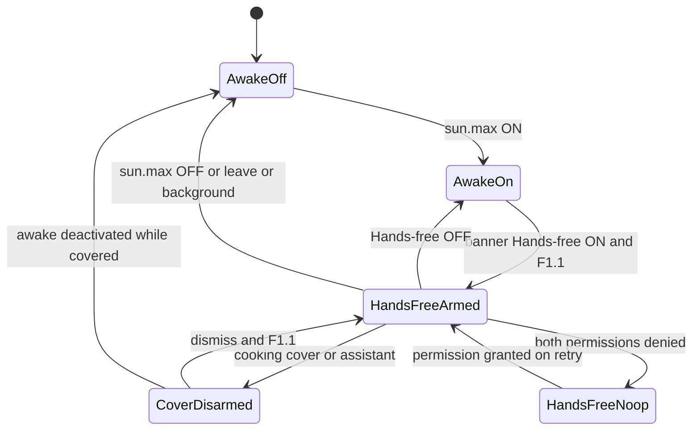

# Data model: 075 hands-free cook controls

**Spec**: [spec.md](./spec.md)  
**Plan**: [plan.md](./plan.md)

Сервер и Y.Doc **не** участвуют. Модель — in-memory сессия карточки + один Bool в UserDefaults.

## AwakeScrollAction

```swift
enum AwakeScrollAction: Equatable {
    case up
    case down
}
```

Единственный командный тип v1. Нет `.next` / `.back` / `.list`.

## AwakeScrollViewport

Вход engine (чистые числа, без UIKit в тестах):

| Поле | Тип | Правила |
|------|-----|---------|
| `boundsHeight` | `CGFloat` | visible height; ≤0 → no-op, offset без изменения |
| `contentHeight` | `CGFloat` | ≥0 |
| `adjustedInsetTop` | `CGFloat` | из `adjustedContentInset` |
| `adjustedInsetBottom` | `CGFloat` | из `adjustedContentInset` |
| `contentOffsetY` | `CGFloat` | текущий y |

`fraction` канон: `AwakeScrollLayout.scrollViewportFraction` = `0.75`.

Выход: новый `contentOffsetY` после clamp. См. [contracts/scroll-delta.md](./contracts/scroll-delta.md).

## AwakeHandsFreeStorage

| Поле | Тип | Правила |
|------|-----|---------|
| key | `"awakeHandsFreeEnabled"` | UserDefaults.standard |
| default | `false` | отсутствует ключ → OFF |
| writer | только UI toggle в banner Menu | teardown awake **не** пишет false |

Не Codable versioning. Не App Group.

## AwakeScrollModality

```swift
enum AwakeScrollCameraModality: Equatable {
    case none
    case hand
    case face
}
```

Резолв: если не armed или camera denied → `.none`. Иначе TrueDepth → `.face`, иначе `.hand`. Voice — отдельный канал, не case этого enum.

## AwakeScrollPermissionSnapshot

| Флаг | Смысл |
|------|--------|
| `micGranted` | record permission |
| `speechGranted` | `SFSpeechRecognizer` auth |
| `cameraGranted` | video |

Denied канал просто не стартует. Snapshot пересчитывать после каждого request и при `UIApplication.willEnterForeground` если F1.1.

## AwakeScrollSession (in-memory, controller)

| Поле | Тип | Правила |
|------|-----|---------|
| `recipeId` | `String` | captured identity |
| `sessionEpoch` | `UInt64` | ++ на любом teardown/start |
| `voiceSessionId` | `UInt64` | ++ на каждом SF re-arm |
| `isStarting` | `Bool` | single-flight; снять `defer` |
| `cooldownUntil` | `Date?` | 0.6 s default после fire (допуск 0.5…0.8) |
| `cameraModality` | `AwakeScrollCameraModality` | |
| `permissions` | `AwakeScrollPermissionSnapshot` | |

Не persist. Deinit view → stop.

## Voice classifier input

| Поле | Правила |
|------|---------|
| `transcript` | trimmed, lowercased для match; исходный регистр не нужен UI |
| `isFinal` | fire только если true, либо stable partial ≥ `stablePartialMs` (300) |

Выход: `AwakeScrollAction?`. Контракт фраз: [contracts/voice-whitelist.md](./contracts/voice-whitelist.md).

## Hand pose input

Нормализованные точки Vision (после зеркала preview, если применяем): thumbTip, thumbCMC (base). Hold 200 ms в том же секторе → один fire.

Секторы: [contracts/gesture-mapping.md](./contracts/gesture-mapping.md).

## Face blink input

`eyeBlinkLeft` / `eyeBlinkRight` blend shapes 0…1. Edge: переход через порог (канон 0.6) из ниже порога. Одновременный double-blink → ignore (не два action).

## Arm predicate (F1.1)

```text
detailVisible
&& isScreenAwakeActive
&& handsFreeEnabled
&& cookingPresentation == nil
&& assistantSheetOpen == false
```

Тест обязан подставлять каждый терм.

## State transitions



## Validation

| Правило | Где | Эффект |
|---------|-----|--------|
| boundsHeight ≤ 0 | engine | no-op |
| cooldown active | controller | drop action |
| transcript not in whitelist | classifier | nil |
| dead-zone thumb | hand | ignore |
| epoch mismatch | controller | drop |

Нет миграций БД.
