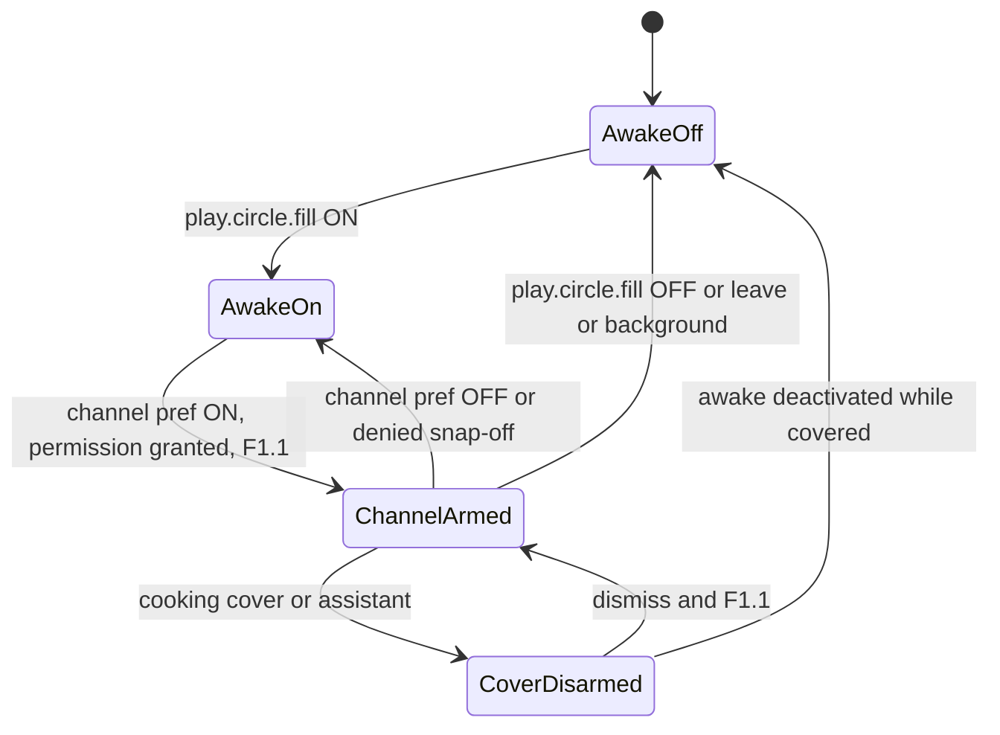

# Data model: 075 hands-free cook controls

**Spec**: [spec.md](./spec.md)  
**Plan**: [plan.md](./plan.md)

Сервер и Y.Doc **не** участвуют. Модель — in-memory сессия карточки + три Bool каналов в UserDefaults.

## AwakeScrollAction

```swift
enum AwakeScrollAction: Equatable {
    case up
    case down
}
```

Единственный командный тип v1. Нет `.next` / `.back` / `.list`.

## AwakeScrollViewport

Вход engine (чистые числа, без UIKit в тестах):

| Поле | Тип | Правила |
|------|-----|---------|
| `boundsHeight` | `CGFloat` | visible height; ≤0 → no-op, offset без изменения |
| `contentHeight` | `CGFloat` | ≥0 |
| `adjustedInsetTop` | `CGFloat` | из `adjustedContentInset` |
| `adjustedInsetBottom` | `CGFloat` | из `adjustedContentInset` |
| `contentOffsetY` | `CGFloat` | текущий y |

`fraction` канон: `AwakeScrollLayout.scrollViewportFraction` = `0.75`.

Выход: новый `contentOffsetY` после clamp. См. [contracts/scroll-delta.md](./contracts/scroll-delta.md).

## AwakeHandsFreeStorage

Три ключа, `UserDefaults.standard`, default `false`:

| Key | Канал |
|-----|--------|
| `awakeHandsFreeVoiceEnabled` | голос |
| `awakeHandsFreeHandEnabled` | жесты |
| `awakeHandsFreeFaceEnabled` | лицо |

Писатели: тумблеры sheet; XOR (hand ON → face false и наоборот); snap-off при denied. Teardown awake **не** пишет false.

Миграция один раз: если новых ключей ещё нет и `awakeHandsFreeEnabled == true` → voice=true и (TrueDepth → face, иначе hand). После миграции старый ключ не source of truth.

Не Codable versioning. Не App Group.

Derived: `isAnyChannelEnabled` = voice \|\| hand \|\| face. Мастер-флага в UI нет.

## AwakeScrollModality

```swift
enum AwakeScrollCameraModality: Equatable {
    case none
    case hand
    case face
}
```

Резолв: `.none` если не armed / camera denied / оба камерных pref false. Иначе если `awakeHandsFreeFaceEnabled` AND TrueDepth → `.face`. Иначе если `awakeHandsFreeHandEnabled` → `.hand`. Voice — отдельный канал.

## AwakeScrollPermissionSnapshot

| Флаг | Смысл |
|------|--------|
| `micGranted` | record permission |
| `speechGranted` | `SFSpeechRecognizer` auth |
| `cameraGranted` | video |

Denied канал просто не стартует. Snapshot пересчитывать после каждого request, при `scenePhase == .active` / `UIApplication.willEnterForeground` и при каждом `onAppear` help sheet. `showsOpenSettings` = micDenied \|\| cameraDenied \|\| speechDenied.

## AwakeScrollSession (in-memory, controller)

| Поле | Тип | Правила |
|------|-----|---------|
| `recipeId` | `String` | captured identity |
| `sessionEpoch` | `UInt64` | ++ на любом teardown/start |
| `voiceSessionId` | `UInt64` | ++ на каждом SF re-arm |
| `isStarting` | `Bool` | single-flight; снять `defer` только если `startID` свой |
| `startID` | `UInt64` | ++ на каждом `startIfNeeded` и `stop`; инвалидирует in-flight start |
| `cooldownUntil` | `Date?` | 0.6 s default после fire (допуск 0.5…0.8) |
| `cameraModality` | `AwakeScrollCameraModality` | |
| `permissions` | `AwakeScrollPermissionSnapshot` | |

Не persist. Deinit view → stop.

## Voice classifier input

| Поле | Правила |
|------|---------|
| `transcript` | trimmed, lowercased для match; исходный регистр не нужен UI |
| `isFinal` | fire только если true, либо stable partial ≥ `stablePartialMs` (300) |

Выход: `AwakeScrollAction?`. Контракт фраз: [contracts/voice-whitelist.md](./contracts/voice-whitelist.md).

## Hand pose input

Нормализованные точки Vision (после зеркала preview, если применяем): thumbTip, thumbCMC (base). Hold 250 ms в том же секторе → один fire.

Секторы: [contracts/gesture-mapping.md](./contracts/gesture-mapping.md).

## Face blink input

ARKit `.userFacing` отдаёт `eyeBlinkLeft` как глаз слева в кадре (= мой правый). Перед классификатором un-mirror: user-left = ARKit right. Дальше коэффициенты 0…1 анатомически (мой левый / мой правый). Edge: переход через порог 0.6 из ниже порога. Если второй глаз явно открыт (`< 0.35`) — сразу `.up`/`.down` (подмигивание). Если второй глаз уже прикрыт — pending 100 ms: второй rising edge в окне → ignore (естественный блинк), иначе fire.

## Arm predicate (F1.1) per channel

```text
detailVisible
&& isScreenAwakeActive
&& channelPref
&& channelPermissionsGranted
&& (face ⇒ TrueDepth)
&& cookingPresentation == nil
&& assistantSheetOpen == false
```

Тест обязан подставлять каждый терм. Voice и camera-канал армятся независимо (кроме XOR hand/face).

## State transitions


```mermaid
stateDiagram-v2
  [*] --> AwakeOff
  AwakeOff --> AwakeOn: play.circle.fill ON
  AwakeOn --> ChannelArmed: channel pref ON, permission granted, F1.1
  ChannelArmed --> AwakeOn: channel pref OFF or denied snap-off
  ChannelArmed --> AwakeOff: play.circle.fill OFF or leave or background
  ChannelArmed --> CoverDisarmed: cooking cover or assistant
  CoverDisarmed --> ChannelArmed: dismiss and F1.1
  CoverDisarmed --> AwakeOff: awake deactivated while covered
```

## Validation

| Правило | Где | Эффект |
|---------|-----|--------|
| boundsHeight ≤ 0 | engine | no-op |
| cooldown active | controller | drop action |
| transcript not in whitelist | classifier | nil |
| dead-zone thumb | hand | ignore |
| epoch mismatch | controller | drop |

Нет миграций БД. Миграция только UserDefaults F1.9.
