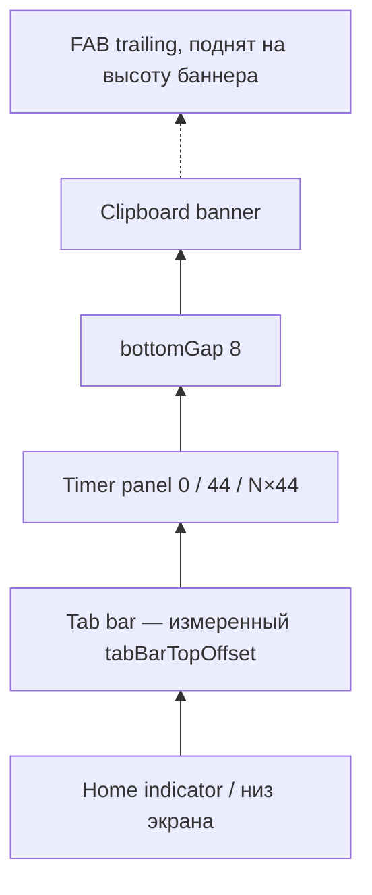

# Layout: баннер импорта ссылки из буфера

**Spec**: [spec.md](./spec.md)  
**Figma**: нет — компактная нижняя плашка по спеке 076, не тост 010 и не системный баннер 061.  
**Аудит**: [layout-audit.json](./layout-audit.json)

> Черновик для **ревью человеком** перед SwiftUI. После согласования — источник истины для приёмки.

---

## Canvas

Оверлей на `AppShellView`, не `safeAreaInset`: списки не пересчитывают высоту. Плашка временная.

| Параметр | Значение |
|----------|----------|
| Хост | весь shell (любой таб, включая готовку) |
| Привязка | `overlay(alignment: .bottom)` |
| Ширина iPhone | контейнер − 2×`horizontalInset` |
| Ширина iPad | max `iPadMaxWidth`, по центру |
| Низ плашки | над таббаром **и** над панелью таймеров, зазор `bottomGap` |
| Z-order | контент табов → баннер буфера → тост (`TransientStatusBanner`) → FAB |

**Критично:** табы не перекрывать. Кнопка «Импортировать» не под Assistant FAB. URL в UI нет.

Нижний chrome, снизу вверх:



Формула нижнего паддинга баннера:

`tabBarTopOffset` (fallback 49) + `MobileTimerPanelLayout.height(...)` + `bottomGap`

FAB, пока баннер виден:

`assistantFabBottomPadding` **+** высота баннера (после layout) **+** `bottomGap`

Пока виден тост — баннер буфера **не рендерить** (один нижний слот, тост приоритетнее). Import sheet / assistant sheet закрывают оверлей системно; баннер при открытом Import sheet не показывать (spec FR-010).

---

## Токены

Файл: `RecipeScalerNative/Views/ClipboardImportBannerLayout.swift`

| Token | Значение | Зачем |
|-------|----------|--------|
| `horizontalInset` | 12 | как legacy `TransientStatusBanner` и timer panel |
| `innerHorizontalPadding` | 16 | текст и кнопка не липнут к краю плашки |
| `innerVerticalPadding` | 12 | компактная высота |
| `stackSpacing` | 12 | зазор сообщение ↔ кнопка |
| `cornerRadius` | 12 | не capsule: справа кнопка, слева многострочный текст |
| `bottomGap` | 8 | воздух над таббаром / таймерами |
| `iPadMaxWidth` | 420 | не растягивать плашку на весь iPad |
| `messageLineLimit` | 3 | Dynamic Type; без внутренней прокрутки |
| `actionSide` | 44 | круглая кнопка 44×44, как hit FAB-класса |
| `swipeDismissDistance` | 56 | порог свайпа вниз |
| `appearDuration` | 0.25 | как тост |

Шрифт сообщения: `.appBody()` (Martian 16). Кнопка: круг 44×44 (`actionSide`), `.buttonBorderShape(.circle)` / `Circle()`, иконка `checkmark`. VoiceOver: `accessibilityLabel` = `import.lets-go`. FAB приложения 50 pt (`AssistantFabStyle.diameter`); здесь явно 44 по запросу.

---

## State: Hidden

Ничего в оверлее. FAB и тост как сегодня. Preview этого стейта не обязателен.

---

## State: Visible (primary)

### Размеры блоков

| Элемент | W×H | Примечание |
|---------|-----|------------|
| Карточка | iPhone: full − 24 pt по ширине; iPad: ≤420; высота hug | низ над chrome, не над home indicator внахлёст с табами |
| HStack | ширина карточки − 32 pt pad | alignment center по вертикали |
| Сообщение | гибкая ширина, hug по высоте | **не** в фиксированной колонке; `frame(maxWidth: .infinity, alignment: .leading)` |
| Кнопка | 44×44 круг | trailing, hug; не делит ширину с текстом через overlay |
| Hit свайпа | вся карточка | кнопка остаётся отдельным accessibility-элементом |

На SE (320 pt) оценка колонки текста: `320 − 24 − 32 − 12 − 44 ≈ 208 pt`. Кнопка — круг, без подписи.

### Дерево (DOM)

```text
AppShellView
└─ overlay bottom: ClipboardImportBanner    // только если eligible и нет тоста
     └─ карточка (pad horizontalInset)
          └─ HStack spacing 12, pad 16/12
               ├─ Text import.clipboard-banner.message
               │     .appBody()
               │     lineLimit 3
               │     fixedSize(horizontal: false, vertical: true)
               │     accessibilityIdentifier clipboardImportBannerMessage
               └─ Button 44×44 circle checkmark (a11y import.lets-go)
                     accessibilityIdentifier clipboardImportBannerAction
```

**Критично:** сообщение и кнопка — соседи по HStack со `Spacer` **не нужен**, если у текста `maxWidth: .infinity`. Не класть кнопку overlay-ом на всю плашку — иначе колонка текста получит не всю ширину (баг 030: 89 pt вместо 137). Кнопка hug trailing.

Жест: `DragGesture` вниз по карточке. Смещение пальца двигает плашку вниз; при `translation.height ≥ swipeDismissDistance` или явном вниз-velocity — dismiss (spec US2). Тап по кнопке не должен требовать свайпа; `minimumDistance` у жеста, чтобы не есть тапы.

Reduce Motion: появление/уход только opacity, без slide.

### SwiftUI / platform notes

- iOS 26+: карточка `.glassEffect(.regular.interactive(), in: .rect(cornerRadius: 12))`. Кнопка как FAB: `.glassProminent` + `.buttonBorderShape(.circle)` + frame 44. Не capsule.
- iOS < 26: `.ultraThinMaterial` + `RoundedRectangle(12)` + лёгкая тень как у legacy тоста, **не** зелёная заливка. Это предложение, не success.
- Текст: `Text("import.clipboard-banner.message")`. Кнопка — `AppSymbol.image("checkmark")` + `accessibilityLabel(Text("import.lets-go"))`. Не `Text(verbatim:)` с сырой ссылкой.
- Баннер **не** расширяет `TransientStatusBanner` (тот — pill/зелёный, без кнопки, автоскрывается).
- `#available` для glass — только в этом view (и токены без `#available` для цифр). Цвет кнопки не через сырой `Color.accentColor` в navbar-смысле; primary action на плашке может быть accent / glassProminent.
- VoiceOver: контейнер `clipboardImportBanner`; действие «закрыть» = тот же dismiss, что свайп (`common.close`).
- Landscape / cooking cover: та же формула низа; если таббар скрыт, `tabBarTopOffset` → `safeAreaInsets.bottom`. Плашка не поворачивается отдельно.

---

## State: Dragging / dismissing

Карточка следует за пальцем только по Y ≥ 0 (вниз). Отпустили раньше порога — spring назад. После порога — уезжает вниз + opacity, затем unmount. Пока жест жив, кнопку не срабатывать.

---

## State: Toast visible / Import sheet

Баннер не в дереве. После успеха импорта candidate consumed — баннер не возвращается в той же сессии.

---

## Примитивы (реализовать до экранов)

| Примитив | Файл | Ответственность |
|----------|------|-----------------|
| `ClipboardImportBannerLayout` | `RecipeScalerNative/Views/ClipboardImportBannerLayout.swift` | все числа из таблицы токенов |
| `ClipboardImportBanner` | `RecipeScalerNative/Views/ClipboardImportBanner.swift` | плашка + свайп + `#Preview` |
| Host overlay | `AppShellView` | placement, паддинг над chrome, подъём FAB, скрытие при тосте/sheet |

Import sheet не верстаем заново: только host открывает существующий.

---

## Матрица приёмки

| State | Light | Dark | Edge case data |
|-------|-------|------|----------------|
| hidden | ☐ | ☐ | нет плашки, FAB на обычной высоте |
| visible, Recipes | ☐ | ☐ | над таббаром, табы видны |
| visible, другой таб / готовка | ☐ | ☐ | тот же низ, не центр экрана |
| visible + timer panel | ☐ | ☐ | над таймерами, не поверх чипов |
| visible + FAB | ☐ | ☐ | кнопка импорта не под кругом FAB |
| SE 320 / XXXL | ☐ | ☐ | 2–3 строки, кнопка без `…` |
| iPad | ☐ | ☐ | ширина ≤ 420, по центру |
| swipe down | ☐ | ☐ | уезжает вниз, табы не переключились |
| тост | ☐ | ☐ | баннер буфера отсутствует |
| Reduce Motion | ☐ | ☐ | без выезда, только fade |

---

## Falsifiable claims

1. **Claim:** Низ карточки не заходит на таббар: зазор ≥ 8 pt над измеренным верхом таббара (или над панелью таймеров, если она есть). Измерение: screenshot / accessibility frame.  
2. **Claim:** Кнопка полностью правее текста; frames не пересекаются; ширина текста = ширина HStack − spacing − ширина кнопки (±1 pt).  
3. **Claim:** На ширине 320 pt RU-сообщение и «Импортировать» оба читаются: у кнопки нет `…`, у текста не больше 3 строк.  
4. **Claim:** Пока баннер виден, нижний край FAB ≥ верхнего края карточки + 8 pt (FAB поднят, не наезжает на кнопку).  
5. **Claim:** В плашке нет URL и нет сырого текста буфера.  
6. **Claim:** Свайп вниз на ≥ 56 pt скрывает плашку; горизонтальный свайп по таббару под ней по-прежнему меняет таб.  
7. **Claim:** Шрифт сообщения — Martian через `.appBody()`, не SF `.font(.system`.

---

## Platform constraints

- Overlay на shell, не отдельный `UIWindow`, не WidgetKit.  
- Не `UIViewRepresentable`.  
- Свайп не должен одновременно переключать таб: жест живёт на карточке, не на всём экране.  
- iOS 26 glass: `glassEffect` после padding/frame; interactive только у карточки и/или кнопки.  
- Системный «вставлено из …» — чужой chrome сверху; нашу плашку из‑за него не двигать.

---

## Stub data (preview / seed)

| Сценарий | Строки | Где |
|----------|--------|-----|
| default RU | `import.clipboard-banner.message` + `import.lets-go` | `#Preview("clipboard-banner-light")` |
| default EN | те же ключи, locale en | `#Preview("clipboard-banner-en")` |
| worst-case wrap | XXXL + SE width 320 | `#Preview("clipboard-banner-xxxl-se")` |
| dark | default RU | `#Preview("clipboard-banner-dark")` |

Preview **без** реального pasteboard: фиксированный visible state. Не показывать выдуманный URL.

Черновик копирайта сообщения (редполитика: «вы», возможность):  
- ru: «Импортировать сайт из буфера обмена?»
- en: «Import a site from the clipboard?»

---

## Changelog

| Дата | Изменение |
|------|-----------|
| 2026-09-14 | Черновик: нижняя плашка, HStack текст+кнопка, свайп вниз, без Figma |
