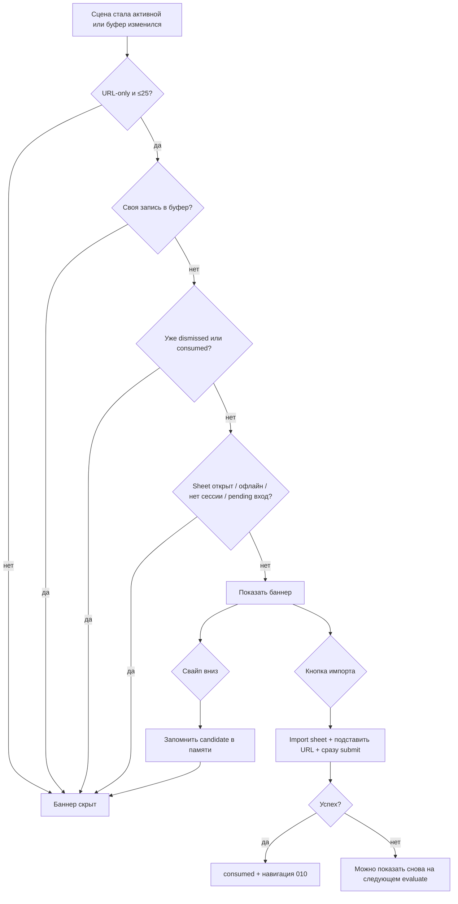

# Спецификация: баннер импорта ссылки из буфера обмена

**Feature Branch**: `076-clipboard-import-banner`  
**Created**: 2026-09-14  
**Status**: Draft  
**Input**: Если человек открывает приложение со ссылкой в буфере, снизу показать небольшой баннер: в буфере как будто ссылка — не хотите импортировать? Справа кнопка. Баннер можно смахнуть вниз — в этой сессии для этой ссылки больше не показывать.

**Зависимости**:
- [010-recipe-import](../010-recipe-import/spec.md) — `ImportRecipeSheet`, `ImportContentClassifier`, `RecipeImportAPI.importURLs`, лимит 25 URL, офлайн-гейт текстового импорта
- [007-app-shell-navigation](../007-app-shell-navigation/spec.md) — `AppShellView`, `AppShellCoordinator.presentImport()`
- [025-share-extension](../025-share-extension/spec.md) — параллельный вход (Share/Action); баннер не должен дублировать только что завершённый импорт с расширения
- [066-offline-banner-debounce](../066-offline-banner-debounce/spec.md) — не мешать debounce офлайн-баннеров; URL-импорт недоступен офлайн так же, как сегмент Text в sheet

**Эталоны**: нижний overlay `TransientStatusBanner` в `AppShellView`; классификация «только URL» как в Import sheet.  
**Layout**: [layout.md](./layout.md) · аудит: `bash scripts/audit-ui-layout.sh specs/076-clipboard-import-banner` (STATIC FAIL до появления view/токенов — ожидаемо).

---

## Границы

**В scope:**

- При каждом приходе приложения на передний план (холодный старт и возврат из фона) на **любом** экране: если в буфере обмена **только http(s)-ссылки** без прочего текста — показать компактный баннер снизу.
- Текст баннера общий, **без** самой ссылки. Справа кнопка импорта.
- Кнопка открывает существующий Import sheet, подставляет ссылку (или ссылки) в текстовый режим и **сразу запускает** импорт.
- Свайп вниз скрывает баннер. Запоминание — **только в памяти процесса**, для этого набора ссылок. После выгрузки приложения баннер для той же ссылки можно показать снова.
- Другой набор ссылок в той же сессии — баннер снова.
- Свои записи в буфер (Copy ссылки рецепта, списка покупок, seed, Telegram-код) баннер не предлагают.
- i18n, a11y, unit-тесты классификации/dismiss.

**Вне scope:**

- Web-клиент (чтение буфера в браузере — другой permission-модель).
- Текст рецепта, фото, файлы в буфере.
- Персистенция скрытых ссылок (UserDefaults, сервер, между устройствами).
- Изменения Share/Action Extension и deep-link импорта.
- Автоимпорт без sheet (тихий фон).
- Показ самой ссылки в баннере.
- Таймаут автоскрытия.

---

## Контекст и мотивация

Share Extension (025) уже закрывает путь «Share → Импорт». Этот баннер — для тех, кто **скопировал ссылку** в Safari / Messages / Telegram и просто открыл Recipe Scaler. Сейчас им нужно: вкладка Import → вставить → подтвердить. Баннер снимает Tax Job «найти Import и вставить».

Ценность: человек видит предложение в момент возврата в приложение и одним нажатием запускает уже знакомый импорт. Свайп — если ссылка случайная или не про рецепт.

---

## Цель v1

1. Скопировал http(s)-ссылку → открыл приложение → снизу баннер.
2. «Импортировать» → sheet открыт, ссылка внутри, импорт уже идёт.
3. Смахнул вниз → эта ссылка в этой сессии больше не предлагается.
4. Выгрузил приложение → можно увидеть баннер снова.

---

## Clarifications

### Session 2026-09-14

- Q: Что делает кнопка? → A: Открыть Import sheet, подставить ссылку и **сразу стартовать** импорт (не тихий импорт без sheet).
- Q: Свайп — на сессию или навсегда? → A: Только память процесса. Персистить ссылку не надо. Выгрузка приложения (пользователем или системой) — нормально показать снова.
- Q: Где показывать? → A: При каждом возврате в приложение, на любом экране (включая готовку).
- Q: Что в буфере? → A: Только чистая ссылка или несколько ссылок без другого текста. Обычный текст рецепта — не предлагать.
- Q: Как показывать? → A: Нижний оверлей, не тост и не бейдж вкладки Import.

---

## User Scenarios & Testing *(mandatory)*

### User Story 1 — Увидел ссылку в буфере и импортировал (Priority: P1)

Человек копирует ссылку на рецепт в другом приложении, переключается в Recipe Scaler. Снизу появляется баннер: в буфере ссылка, можно импортировать. Нажимает кнопку справа — открывается Import sheet с этой ссылкой, импорт стартует сам. Дальше — тот же успех, что у обычного URL-импорта (один рецепт → карточка, несколько → список, тост).

**Why this priority**: это вся ценность фичи; без этого баннер бесполезен.

**Independent Test**: положить в буфер один `https://…` URL, открыть приложение с любого таба → баннер виден → тап по кнопке → sheet на текстовом режиме с этой ссылкой и идёт импорт.

**Acceptance Scenarios**:

1. **Given** буфер содержит одну http(s)-ссылку без другого текста, пользователь не смахнул её в этой сессии, **When** приложение становится активным, **Then** снизу на текущем экране виден баннер с текстом про ссылку в буфере и кнопкой импорта справа.
2. **Given** баннер виден, **When** пользователь нажимает кнопку импорта, **Then** открывается существующий Import sheet, в текстовом поле уже эта ссылка, импорт запускается без второго нажатия.
3. **Given** импорт из баннера успешно завершился одним рецептом, **When** sheet закрывается, **Then** пользователь оказывается на карточке этого рецепта, как после обычного импорта.
4. **Given** в буфере несколько http(s)-ссылок без другого текста (не больше лимита Import), **When** пользователь импортирует с баннера, **Then** все эти ссылки уходят в тот же URL-pipeline, что ручная вставка.

---

### User Story 2 — Смахнул — больше не мешает (Priority: P1)

Человек видит баннер, ссылка ему не нужна. Смахивает баннер вниз. Пока приложение живо, возвраты из фона с той же ссылкой в буфере баннер не показывают. Если позже в буфере другой набор ссылок — баннер снова. Если приложение выгрузили и открыли заново с той же ссылкой — баннер можно показать.

**Why this priority**: без надёжного dismiss баннер станет спамом на каждом возврате.

**Independent Test**: показать баннер → свайп вниз → background → foreground с тем же буфером → баннера нет; убить процесс → снова открыть с тем же буфером → баннер есть.

**Acceptance Scenarios**:

1. **Given** баннер виден, **When** пользователь смахивает его вниз, **Then** баннер исчезает и для этого набора ссылок не появляется до конца жизни процесса.
2. **Given** пользователь смахнул набор A, **When** в буфере оказывается другой URL-only набор B, **Then** баннер показывается для B.
3. **Given** пользователь смахнул ссылку, **When** процесс приложения завершается и запускается заново с той же ссылкой в буфере, **Then** баннер снова можно показать.
4. **Given** импорт этой ссылки в этой сессии уже успешно завершился (из баннера или из вручную открытого sheet), **When** пользователь возвращается на передний план с той же ссылкой в буфере, **Then** баннер не показывается.

---

### User Story 3 — Не предлагает мусор и свои Copy (Priority: P1)

Баннер только для «в буфере чистые ссылки». Скопированный текст рецепта, смесь «посмотри https://…» + комментарий, пустой буфер — тишина. Если пользователь только что скопировал что-то **из этого приложения** (шаринг рецепта, список покупок, seed, код Telegram) — баннер не всплывает.

**Why this priority**: ложные срабатывания убивают доверие быстрее, чем отсутствие баннера.

**Independent Test**: буфер = абзац рецепта; буфер = «текст + URL»; Copy share-URL из приложения — баннера нет. Буфер = один URL с сайта рецептов — баннер есть.

**Acceptance Scenarios**:

1. **Given** в буфере текст рецепта без URL или с URL плюс другой текст (`isUrlOnly == false`), **When** приложение становится активным, **Then** баннер не показывается.
2. **Given** приложение само записало строку в буфер, **When** сразу после этого сцена становится активной или приходит уведомление об изменении буфера, **Then** баннер не показывается для этого содержимого.
3. **Given** буфер пуст или содержит не http(s)-ссылку, **When** приложение активно, **Then** баннер не показывается.

---

### Edge Cases

- Import sheet уже открыт — баннер не показывать (не второй sheet и не оверлей поверх формы).
- Идёт вход из Share/Action/file/deep-link (pending импорт или открытие только что импортированного рецепта) — не показывать баннер, пока этот вход не закончился.
- Офлайн / сегмент Text в Import недоступен — баннер не показывать: URL-импорт всё равно нельзя начать.
- Больше 25 ссылок — баннер не показывать (существующий лимит Import).
- Пользователь не может импортировать (нет сессии) — баннер не показывать.
- Баннер и зелёный тост (`TransientStatusBanner`) одновременно: после успеха импорта баннер буфера скрыт (ссылка consumed); тост живёт своей жизнью.
- Готовка / voice / assistant sheet / cooking cover: баннер **можно** показать (выбор: любой экран). Свайп его убирает. Кнопка всё равно открывает Import sheet поверх текущего экрана.
- Системный индикатор iOS «вставлено из …»: возможный побочный эффект чтения буфера; UI приложения **не** дублирует содержимое буфера.
- Смена языка в Профиле: текст баннера сразу на новом языке.
- Несколько одинаковых URL в буфере: классификатор дедуплицирует, как в Import sheet.

---

## Requirements *(mandatory)*

### Functional Requirements

- **FR-001**: При переходе сцены в активное состояние и при изменении буфера, пока сцена активна, система MUST переоценить буфер и показать или скрыть баннер согласно правилам ниже.
- **FR-002**: Баннер MUST показываться только если содержимое буфера классифицируется как URL-only: один или несколько `http`/`https` URL, без прочего смыслового текста. Та же семантика, что `ImportContentClassifier` в Import sheet.
- **FR-003**: Баннер MUST быть нижним оверлеем над текущим экраном (включая любой таб), над таббаром / home indicator, не перекрывая табы. Слева/по центру — сообщение, справа — кнопка действия.
- **FR-004**: Текст баннера MUST быть общим («похоже, в буфере ссылка, можно импортировать»), без отображения URL и без сырого содержимого буфера. Строки только из `Localizable.xcstrings` (en+ru), без хардкода и без fallback-дефолтов.
- **FR-005**: Кнопка MUST открыть существующий Import sheet в текстовом режиме, подставить извлечённые URL и сразу запустить тот же submit, что ручное «Импортировать». Новый импорт-pipeline не создавать.
- **FR-006**: Свайп вниз MUST скрыть баннер и запомнить текущий набор URL **только в памяти процесса**. Память не переживает выгрузку приложения.
- **FR-007**: Пока набор URL совпадает с dismiss/consumed в этой сессии, баннер MUST NOT появляться при повторных foreground.
- **FR-008**: Если набор URL изменился на другой валидный URL-only, баннер MUST показаться снова, даже если предыдущий был смахнут.
- **FR-009**: Система MUST NOT предлагать содержимое, которое только что записала сама в буфер.
- **FR-010**: Баннер MUST NOT показываться, если Import sheet уже представлен, если URL-импорт сейчас недоступен (офлайн по тем же правилам, что сегмент Text в 010), если ссылок больше 25, если пользователь не в состоянии импортировать, или пока обрабатывается вход Share/Action/file/deep-link.
- **FR-011**: Успешный импорт этого набора URL в этой сессии MUST считать набор consumed (как после свайпа). Отмена/ошибка в sheet MUST NOT писать набор в dismissed: после закрытия sheet баннер может вернуться на следующем foreground, если ссылка всё ещё в буфере.
- **FR-012**: Logout / смена пользователя MUST сбросить in-memory dismissed/consumed и скрыть баннер. Никакого диска, App Group, Keychain.
- **FR-013**: Баннер MUST быть доступен VoiceOver (сообщение + кнопка), с идентификаторами для UI-тестов. Свайп dismiss MUST иметь accessibility-действие «закрыть».
- **FR-014**: Баннер MUST NOT автоскрываться по таймеру.

### Key Entities

- **Clipboard import candidate**: нормализованный набор http(s) URL из буфера (порядок стабильный, дедуп как в классификаторе). Это ключ показа и dismiss.
- **Session dismiss memory**: in-memory множество candidate, которые смахнули или успешно импортировали в этом процессе. Пропадает с процессом и при logout.
- **Clipboard import banner**: UI-предложение импорта; не системный баннер 061 и не тост.

---

## Success Criteria *(mandatory)*

### Measurable Outcomes

- **SC-001**: После копирования чистой http(s)-ссылки вне приложения и переключения в Recipe Scaler баннер появляется на текущем экране **без** захода на вкладку Import — достаточно возврата в приложение.
- **SC-002**: От появления баннера до старта импорта — одно нажатие кнопки; пользователь видит тот же Import sheet и прогресс, что при ручном импорте URL.
- **SC-003**: После свайпа вниз та же ссылка не предлагается, пока процесс жив, в том числе после ухода в фон и возврата.
- **SC-004**: После полной выгрузки приложения та же ссылка в буфере снова может вызвать баннер.
- **SC-005**: Текст рецепта, смесь текста со ссылкой и Copy из самого приложения не показывают баннер ни на одном табе.
- **SC-006**: Человек понимает предложение без чтения URL: сообщение говорит, что в буфере ссылка, и что её можно импортировать.

---

## Assumptions

- Native-only: web эту фичу в этой спецификации не получает.
- «Сессия» = жизнь процесса приложения, не сцена SwiftUI и не календарный день.
- Смена ссылки в буфере без убийства процесса возможна (ушёл в Safari через переключатель, скопировал другое, вернулся) — это тот же процесс, другой candidate.
- Классификация URL-only совпадает с уже принятой в Import sheet / web `import-content`.
- Лимит 25 URL и офлайн-поведение Import не меняются.
- Гостевой/неавторизованный пользователь баннер не видит — импорт URL требует той же сессии, что вкладка Import.
- Системный тост iOS про доступ к буферу допустим как платформенное поведение; мы не показываем содержимое буфера в своём UI.
- Макет Figma для баннера нет: компактная нижняя плашка, сообщение + кнопка справа, свайп вниз. Перед вёрсткой — `layout.md` и human review, как у других UI-спек.
- Черновик копирайта: сообщение `import.clipboard-banner.message` — «Импортировать сайт из буфера обмена?» / «Import a site from the clipboard?» Кнопка на плашке — иконка checkmark; VoiceOver/название действия — `import.lets-go` («Импортировать» / «Import»). Точные ключи — в плане; в UI без хардкода.

---

## Конституционная проверка

| Gate | Статус | Evidence |
|------|--------|----------|
| CRDT-first | N/A | Импорт идёт через существующий серверный pipeline 010; Y.Doc не трогаем напрямую |
| Web parity | N/A (осознанно) | Native-only clipboard UX; серверный контракт импорта не меняется |
| Offline-first | PASS | Баннер скрыт, когда URL-импорт недоступен; офлайн-приложение остаётся usable |
| Native UI | PASS | SwiftUI overlay + существующий sheet |
| Phased delivery | PASS | Один вертикальный срез: detect → banner → sheet auto-submit → dismiss |
| i18n | PASS | Новые ключи в xcstrings, en+ru, без fallback |
| Documentation | PASS | spec → plan → tasks |

---

## Downstream consumers

- **SwiftUI**: `AppShellView` (overlay), `ImportRecipeSheet` (prefill + auto-submit), возможно `AppShellCoordinator`
- **Composition root**: короткий `@Observable` store в `AppContainer` (не `.shared`), teardown из logout
- **Cross-process**: N/A (Share Extension не меняем; только не конкурируем с pending входом)
- **Sync / Y.Doc**: N/A напрямую; после импорта — как 010
- **Persisted**: ничего
- **Tests**: классификация candidate, dismiss/consumed, ignore self-write, gate «sheet already open» / offline / >25

---

## Positive invariants

| Effect | Invariant | Test |
|--------|-----------|------|
| буфер `https://a.example/` | candidate URL-only, баннер eligible | `test_single_https_is_candidate` |
| буфер «смешайте муку https://a.example/» | не candidate | `test_mixed_text_not_candidate` |
| два URL без текста | candidate из дедупа | `test_multiple_urls_only` |
| swipe candidate A, foreground A | баннер скрыт | `test_dismiss_survives_foreground` |
| swipe A, буфер B | баннер для B | `test_new_url_reshows` |
| dismiss A, «перезапуск процесса» (новый store) | A снова eligible | `test_memory_clears_on_new_session` |
| успешный импорт A | A consumed | `test_successful_import_consumes` |
| ошибка/отмена импорта A | A не consumed | `test_failed_import_does_not_consume` |
| self-write pasteboard | не eligible | `test_ignores_own_copy` |
| Import sheet presented | баннер не показан | `test_hidden_when_import_sheet_open` |
| 26 URL | не eligible | `test_over_limit_hidden` |

---

## Async lifecycle

| Op | Identity | Re-check | Cancel owner | Stale test |
|----|----------|----------|--------------|------------|
| Evaluate pasteboard on `.active` | `evaluateGeneration` + current userId | generation и userId совпадают; sheet не open | store / scene owner | stale evaluate после logout не показывает баннер |
| Prefill + auto-submit import | import presentation id + URL set | sheet ещё для этого presentation; URLs те же | Import sheet task (существующий `importTask`) | повторный тап не запускает второй submit |
| Pasteboard change while active | generation | не self-write; candidate ≠ dismissed | store | собственный Copy не открывает баннер |

Правила: [docs/agents/ASYNC-LIFECYCLE.md](../../docs/agents/ASYNC-LIFECYCLE.md). Нет polling-таймера. Нет персистентного last-URL на диске.

---

## Teardown / resource inventory

| Path | Postcondition |
|------|----------------|
| Swipe dismiss | баннер скрыт; candidate в in-memory dismissed |
| Successful import | баннер скрыт; candidate consumed; sheet закрыт как в 010 |
| Logout / account switch / delete | store cleared, баннер скрыт, tasks отменены |
| Background | баннер можно оставить скрытым визуально с UI; dismissed память жива |
| Process death | память пуста |
| Import sheet presented | баннер не рендерится |
| Failed/cancelled import | dismissed не пишем; можно показать снова на следующем eligible evaluate |

---

## Verification

- Unit: классификация, dismiss/consumed, self-write, gates (sheet, offline, лимит, logout).
- Simulator/device: скопировать URL в Safari → переключиться в приложение на Recipes и на другом табе → баннер → импорт стартует в sheet; свайп → background/foreground без баннера; Terminate → баннер снова.
- Регрессия: Copy share-ссылки рецепта из приложения баннер не поднимает; Share Extension импорт по-прежнему открывает рецепт без конкурирующего баннера на входе.
- i18n: `LocalizationConsistencyTests` зелёный; runtime смена языка обновляет текст баннера.
- Layout: `layout.md` + human review до финальной вёрстки плашки.

---

## Риски

| Риск | Митигация |
|------|-----------|
| iOS показывает «вставлено из Safari» при чтении буфера | Не класть URL в наш UI; читать минимально для URL-only; в плане — наименее инвазивный detect, который всё ещё отличает смесь от чистой ссылки |
| Баннер поверх готовки | Сознательно in-scope; свайп дешёвый; не блокирует жесты готовки вне плашки |
| Конфликт с `TransientStatusBanner` и Assistant FAB | Плашка над таббаром; consumed после успеха, тост отдельно; кнопка импорта не под FAB |
| Ложный импорт случайного URL | Свайп + не автостарт без кнопки; sheet всё же виден, можно отменить существующим UX |
| Двойной импорт той же ссылки после Share Extension | Gate на pending share/file/deep-link вход; после успеха sheet — consumed |

---

## Связь с соседними спеками

| Спека | Связь |
|-------|--------|
| 010 | Переиспользуем sheet, классификатор, URL API, лимит, офлайн Text |
| 025 | Не меняем extension; не перебиваем его вход баннером |
| 061 | Другой баннер (системный, сверху списка); не объединять |
| 066 | URL-импорт по-прежнему мгновенно недоступен офлайн; этот баннер не использует debounce gate |

---

