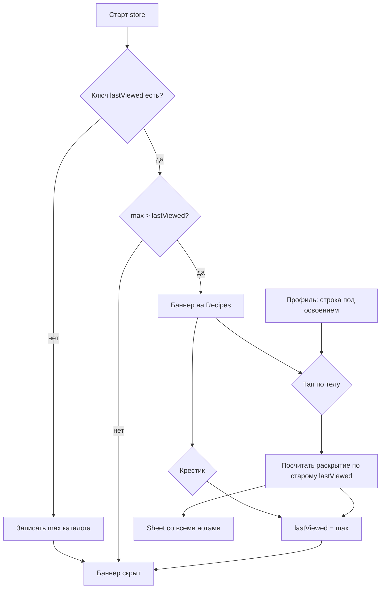

# Спецификация: in-app новости релиза на iOS

**Feature Branch**: `077-ios-release-notes`  
**Created**: 2026-09-14  
**Status**: Draft  
**Input**: Дать на iOS способ рассказать о новинках приложения: баннер + лист, как на вебе, но свой каталог в бинарнике. Сервер не участвует.

**Зависимости**:
- [013-account-settings](../013-account-settings/spec.md) — `AccountView`, футер About/версия
- [038-feature-adoption-tracker](../038-feature-adoption-tracker/spec.md) — секция «Насколько вы освоили Recipe Scaler»; пункт новостей — строка сразу под ней
- [061-system-banner](../061-system-banner/spec.md) — слоты хрома над списком рецептов и корнем коллекций, визуальный эталон карточки, порядок поверх других алертов
- [007-app-shell-navigation](../007-app-shell-navigation/spec.md) — вкладка Recipes, `RecipeListView` / `CollectionsRootView`

**Эталоны**: веб `ReleaseNotesBanner` + `ReleaseNotesDialog` + `useReleaseNotes` (поведение баннера/листа/seed, **не** каталог и **не** `last_viewed_release_version` на сервере); native `SystemBannerView` / `SystemBannerChrome` / `SystemBannerListRow`.

---

## Границы

**В scope:**

- Каталог новостей **внутри бинарника iOS**: целочисленный `version`, дата, title/body для `ru` и `en`. Не веб-каталог.
- Баннер над списком рецептов / корнем коллекций (те же слоты, что системный баннер 061): метка «обновления» + заголовок **последней** ноты.
- Тап по телу баннера → sheet со всем каталогом. Крестик закрывает баннер, лист не открывает.
- «Уже видел» только на устройстве. Нет ключа → записать текущий max, баннер не показать.
- Сборка, которая только вводит механизм: баннера нет (нет ключа = seed). Баннер появляется со **следующей** App Store-сборки, где max каталога вырос.
- Пункт в Профиле: в секции освоения, строка под «Насколько вы освоили Recipe Scaler». Тот же sheet. Если каталог пустой — строки нет.
- Хром UI в `Localizable.xcstrings`. Тексты нот — контент каталога, `Text(verbatim:)`.
- Юнит-тесты стора. Шаг в `prepare-ios-release`: DRAFT in-app ноты отдельно от What’s New стора.

**Вне scope:**

- Веб-каталог и паритет содержимого (MCP, Chrome-расширение и т.п.).
- Сервер, `/api/settings`, `last_viewed_release_version`, `SystemBanner` как канал новостей.
- Диплинки в функцию, HTML/Markdown в теле, пуши.
- Показ баннера в той же сборке, которая вводит механизм.
- Виджеты, App Group, учёт «уже видел» на аккаунте / между устройствами.
- Публикация What’s New в App Store Connect (остаётся отдельным текстом).

---

## Контекст и мотивация

На вебе уже есть баннер и архив релизнотов. На iOS после обновления из App Store человек не видит, что изменилось в приложении: стор пишет What’s New, внутри приложения — тишина. Системный баннер 061 — опер-канал с сервера, не архив версий.

Каталог зашит в приложение, потому что новость — часть этой сборки. Сервер не знает, какая версия клиента что умеет, и в этой фиче не участвует.

v1 **рассказывает**, не проводит в функцию: закрыть крестиком или прочитать. Активация новой возможности остаётся гипотезой, не acceptance этой спеки.

---

## Цель v1

1. После обновления, которое привезло ноту с `version` больше сохранённого — баннер на вкладке Recipes.
2. Тап → sheet со списком нот; крестик или открытие листа помечают текущий max просмотренным.
3. Новая установка и первое появление кода на уже стоявшем приложении — без баннера.
4. Архив всегда доступен из Профиля (если каталог не пустой), рядом с освоением.

---

## Clarifications

### Session 2026-09-14

- Q: Зачем рассказывать? → A: Заметить новую возможность + UX как на вебе (баннер/лист) + после обновления сборки.
- Q: Какие ноты? → A: Отдельный iOS-каталог, только то, что появилось в приложении.
- Q: Где UI? → A: Баннер в списке → sheet; архив в Профиле.
- Q: Диплинк? → A: Нет. Как на вебе: закрыть или прочитать.
- Q: Новая установка? → A: Как на вебе: seed max, баннер только после следующего обновления.
- Q: Сервер? → A: Нет. Каталог и «уже видел» только в приложении.
- Q: Seed на апгрейде существующих? → A: Да, как «ключа нет». Баннер со сборки **следующей** за той, где фичу разработали.
- Q: Куда пункт Профиля? → A: Под «Насколько вы освоили Recipe Scaler», не в футер с About.

---

## User Scenarios & Testing *(mandatory)*

### User Story 1 — Увидел новость после обновления (Priority: P1)

Человек обновляет приложение из App Store. В этой сборке в каталоге есть нота с номером больше, чем устройство уже отметило. На вкладке Recipes (список или коллекции) появляется баннер: метка обновлений и заголовок последней ноты. Тап открывает sheet. Крестик убирает баннер.

**Why this priority**: это единственный момент, когда новость сама приходит к человеку.

**Independent Test**: на устройстве lastViewed = N, в каталоге max = N+1 → баннер с title ноты N+1; крестик → баннера нет после перезапуска; тап → sheet.

**Acceptance Scenarios**:

1. **Given** на устройстве сохранён lastViewed = N и в каталоге сборки max = N+1, **When** пользователь открывает вкладку Recipes, **Then** виден баннер с меткой обновлений и заголовком ноты версии N+1.
2. **Given** баннер виден, **When** пользователь тапает по телу баннера (не по крестику), **Then** открывается sheet со списком нот каталога.
3. **Given** баннер виден, **When** пользователь тапает крестик, **Then** баннер исчезает сразу и не возвращается, пока max каталога не вырастет снова.
4. **Given** одновременно активен серверный системный баннер 061, **When** оба имеют что показать, **Then** системный выше, баннер новостей ниже. `DatabaseInitFailed` выше обоих.

---

### User Story 2 — Первая установка и первая сборка с механизмом молчат (Priority: P1)

Новая установка не вываливает историю. Обновление на сборку, которая **только вводит** этот код (ключа ещё нет), тоже молчит: устройство записывает текущий max как просмотренный. Баннер появится только в **следующей** сборке с большим max.

**Why this priority**: без seed баннер станет спамом архива на всех существующих пользователях в день релиза механизма.

**Independent Test**: стереть ключ (или свежий симулятор) при каталоге max = 3 → баннера нет, ключ стал 3; поднять каталог до 4 без сброса ключа → баннер есть.

**Acceptance Scenarios**:

1. **Given** ключа lastViewed нет и каталог не пустой с max = M, **When** приложение запускается, **Then** баннер не показывается и lastViewed становится M.
2. **Given** lastViewed уже равен текущему max, **When** пользователь открывает Recipes, **Then** баннера нет.
3. **Given** каталог пустой, **When** пользователь открывает Recipes и Профиль, **Then** нет баннера и нет строки новостей в секции освоения.

---

### User Story 3 — Архив в Профиле (Priority: P1)

Человек хочет перечитать, что умеет приложение, не дожидаясь баннера. В Профиле, сразу под «Насколько вы освоили Recipe Scaler», есть пункт, который открывает тот же sheet. Открытие помечает текущий max просмотренным: если баннер ещё висел, он гаснет.

**Why this priority**: иначе новости существуют только один раз после апдейта.

**Independent Test**: каталог не пустой → строка под освоением → sheet; пустой каталог → строки нет; открытие sheet при видимом баннере → баннер гаснет.

**Acceptance Scenarios**:

1. **Given** в каталоге есть хотя бы одна нота, **When** пользователь открывает Профиль, **Then** под строкой освоения есть пункт архива новостей.
2. **Given** пункт виден, **When** пользователь его открывает, **Then** показывается тот же sheet, что с баннера.
3. **Given** баннер виден и lastViewed < max, **When** пользователь открывает архив из Профиля, **Then** lastViewed становится max и баннер больше не показывается.
4. **Given** каталог пустой, **When** пользователь открывает Профиль, **Then** секция освоения на месте, строки новостей нет. About и номер версии не меняются.

---

### User Story 4 — Лист: непрочитанное раскрыто (Priority: P2)

В sheet все ноты каталога: заголовок, дата, тело. Ноты с `version` больше lastViewed **на момент открытия** раскрыты, остальные свёрнуты. Сначала считается, что раскрыть, потом пишется max — иначе всё схлопнется в том же кадре.

**Why this priority**: без этого лист = стена старого текста.

**Independent Test**: lastViewed = 2, каталог 1…4 → открыть sheet → 3 и 4 раскрыты, 1 и 2 свёрнуты; повторно открыть → все свёрнуты (или ни одна не считается непрочитанной).

**Acceptance Scenarios**:

1. **Given** lastViewed = N и есть ноты > N, **When** sheet открывается, **Then** ноты с version > N раскрыты, остальные свёрнуты.
2. **Given** sheet открыт, **When** lastViewed обновляется до max в том же открытии, **Then** уже раскрытые секции не схлопываются из‑за этой записи.
3. **Given** язык интерфейса `ru` или `en`, **When** показывается баннер, sheet или строка Профиля, **Then** хром из xcstrings, title/body ноты — из каталога для этого языка, через `Text(verbatim:)` для контента ноты.

---

### Edge Cases

- Смена языка в Профиле: баннер и sheet сразу на новом языке (каталог уже в бинарнике, рефетча нет).
- Логаут / смена пользователя: lastViewed **не** сбрасывается — это свойство устройства и сборки, не аккаунта.
- Режим screenshot-capture (DEBUG): баннер новостей скрыт, как системный 061.
- Тело ноты длинное: многострочный текст, без HTML. Ссылки в v1 не интерактивны (plain text).
- Несколько нот в одной App Store-версии: баннер показывает title **max**; в sheet все, у которых version > lastViewed, раскрыты.
- Номер маркетинговой версии приложения (`CFBundleShortVersionString`) не является ключом показа; ключ — целочисленный `version` каталога.
- Одновременно 076 clipboard-баннер снизу и этот сверху списка: разные поверхности, не объединять.
- Пустой title/body в каталоге не допускается на этапе добавления ноты (ревью в `prepare-ios-release`); рантайм не подставляет fallback-строки.

---

## Requirements *(mandatory)*

### Functional Requirements

- **FR-001**: Система MUST хранить каталог новостей в бинарнике приложения. Каждая нота: монотонный целочисленный `version`, дата, `title` и `body` для `ru` и `en`.
- **FR-002**: Система MUST NOT загружать каталог, тексты нот или маркер «уже видел» с сервера. `SystemBanner` (061) MUST NOT использоваться как канал этих новостей.
- **FR-003**: Маркер lastViewed MUST жить только на устройстве. Отсутствие или порча маркера MUST трактоваться как «ключа нет».
- **FR-004**: Если ключа нет и каталог не пустой, система MUST записать lastViewed = max(version) и MUST NOT показать баннер.
- **FR-005**: Баннер MUST показываться на вкладке Recipes (список, корень коллекций, пустые и загрузочные состояния этих экранов) тогда и только тогда, когда max(version) > lastViewed и каталог не пустой.
- **FR-006**: Баннер MUST скроллиться вместе со списком, не липнуть сверху. Слоты — те же, что у 061. Порядок: DatabaseInitFailed → системный баннер 061 → баннер новостей.
- **FR-007**: Баннер MUST показать локализованную метку обновлений и `title` ноты с максимальным `version`. Визуально — карточка в духе `SystemBannerView`, не жёлтая веб-полоска.
- **FR-008**: Тап по телу баннера MUST открыть sheet. Тап по крестику MUST скрыть баннер и записать lastViewed = max, не открывая sheet.
- **FR-009**: Открытие sheet (с баннера или из Профиля) MUST записать lastViewed = max. Раскрытие непрочитанных MUST считаться по lastViewed **до** этой записи.
- **FR-010**: Sheet MUST показать все ноты каталога (свежие сверху): заголовок, дата в локали интерфейса, тело. Непрочитанные раскрыты, прочитанные свёрнуты.
- **FR-011**: В Профиле, в той же секции, что освоение, сразу под строкой «Насколько вы освоили Recipe Scaler», система MUST показать пункт архива, если каталог не пустой. Пустой каталог — пункта нет. Футер About / версия не меняется.
- **FR-012**: Хром (метка, a11y открыть/закрыть, заголовок sheet, пункт Профиля) MUST быть в `Localizable.xcstrings` (en+ru), без хардкода и без fallback-дефолтов. Title/body нот MUST рендериться как runtime-контент (`Text(verbatim:)`), язык — `AppLanguagePreference`.
- **FR-013**: Логаут MUST NOT сбрасывать lastViewed. Screenshot-capture MUST скрывать баннер новостей.
- **FR-014**: `prepare-ios-release` MUST предлагать DRAFT in-app ноты (ru+en) отдельно от What’s New стора; оба текста — по `.agents/redpolitika.md`. In-app ноту в каталог не класть без явной проверки человеком.

### Key Entities

- **iOS release note**: запись каталога в бинарнике (`version`, дата, title/body ru+en). Не запись веб-каталога и не What’s New стора.
- **lastViewed**: целое на устройстве — максимальный `version`, который пользователь закрыл или открыл в листе. Нет ключа = ещё не инициализировано (seed, не «ноль»).
- **Release notes banner**: клиентский баннер на Recipes; не 061 и не 076.
- **Release notes sheet**: один sheet на баннер и Профиль.

---

## Success Criteria *(mandatory)*

### Measurable Outcomes

- **SC-001**: После обновления на сборку, где max каталога больше lastViewed, баннер виден на Recipes **без** захода в Профиль и **без** сети.
- **SC-002**: Новая установка и первый запуск сборки, которая вводит механизм, баннер не показывают.
- **SC-003**: Крестик или открытие sheet убирают баннер так, что холодный старт его не возвращает, пока max не вырастет.
- **SC-004**: Архив открывается из Профиля одним тапом по строке под освоением; тот же состав нот, что с баннера.
- **SC-005**: Человек понимает, что это новость приложения, а не системный опер-баннер: метка обновлений + заголовок ноты, без текста «What's New» / «для App Store» / «веб-баннер» (редполитика).
- **SC-006**: Поведение воспроизводится офлайн и после логаута на том же устройстве (баннер не «оживает» от смены аккаунта).

---

## Assumptions

- Native-only каталог. Веб оставляет свой список и свой `lastViewedReleaseVersion`.
- «Следующая сборка» = следующий App Store / TestFlight бинарь, в котором в каталог добавили ноту с version > max предыдущего бинаря. Не hot-patch с сервера.
- В сборке 077 каталог может быть пустым или с нотами; в обоих случаях эта сборка баннер не покажет (seed).
- Визуал баннера копирует 061 (карточка, отступы, типографика `.appHeadline` / `.appFootnote`). Отдельный Figma-макет и `layout.md` не обязательны, пока не отклоняемся от 061. Если отклонимся — `layout.md` + human review до вёрстки.
- Редполитика: новость для человека, «вы», возможность не команда; площадка не торчит из текста.
- What’s New стора и in-app нота — разные тексты даже про один релиз.
- Нет требования синхронизировать lastViewed между iPhone и iPad одного человека.

---

## Конституционная проверка

| Gate | Статус | Evidence |
|------|--------|----------|
| CRDT-first | N/A | Рецепты / Y.Doc не трогаем |
| Web parity | PASS (осознанно частичный) | UX баннер+лист как на вебе; каталог и persistence **намеренно** не общие — сервер не знает версию клиента |
| Offline-first | PASS | Всё локально; сеть не нужна |
| Native UI | PASS | SwiftUI баннер + sheet, без WebView |
| Phased delivery | PASS | Один срез: каталог → seed → баннер → sheet → Профиль |
| i18n | PASS | Хром в xcstrings; ноты — runtime verbatim по языку интерфейса |
| Documentation | PASS | spec → (далее plan/tasks); skill `prepare-ios-release` обновляется |

---

## Downstream consumers

- **SwiftUI**: `RecipeListView`, `CollectionsRootView` (слоты 061), `AccountView` (`featureAdoptionSection`), новый banner/sheet
- **Composition root**: `@Observable` store в `AppContainer`, inject через `.appEnvironment`; не `.shared`
- **Persistence**: только on-device marker (UserDefaults приложения, не App Group)
- **Logout**: store **не** clear-ит lastViewed; баннер скрывается только по правилам seed/max
- **Cross-process**: N/A
- **Sync / Y.Doc**: N/A
- **Skills / docs**: `.agents/skills/prepare-ios-release/SKILL.md`, при необходимости `docs/RELEASES.md`
- **Tests**: стор seed/dismiss/open/expand; `LocalizationConsistencyTests` на новые ключи хрома

---

## Positive invariants

| Effect | Invariant | Test |
|--------|-----------|------|
| нет ключа, max = 3 | lastViewed становится 3, баннера нет | `test_missing_key_seeds_max_no_banner` |
| ключ 3, max 3 | баннера нет | `test_caught_up_hides_banner` |
| ключ 3, max 4 | баннер, title ноты 4 | `test_higher_max_shows_banner` |
| dismiss при max 4 | ключ 4, баннера нет | `test_dismiss_writes_max` |
| open sheet при ключе 3, max 4 | ключ 4 | `test_open_sheet_writes_max` |
| open sheet, ключ 2, ноты 1…4 | раскрыты 3 и 4; расчёт до записи ключа | `test_unread_expanded_before_mark` |
| пустой каталог | нет баннера, нет строки Профиля | `test_empty_catalog_hides_surfaces` |
| logout при ключе 4 | ключ остаётся 4 | `test_logout_does_not_reset_last_viewed` |
| screenshot-capture | баннер не рендерится | DEBUG-ветка в `ReleaseNotesChrome`, как у 061 |

---

## Async lifecycle

Сети и фоновых задач нет. Единственное «время»: синхронный seed при старте store и синхронная запись lastViewed на dismiss/open.

| Op | Identity | Re-check | Cancel owner | Stale test |
|----|----------|----------|--------------|------------|
| Seed if missing | однократный init store | ключ всё ещё отсутствует | store | повторный init не затирает уже записанный lastViewed меньшим max старого каталога в том же процессе |
| Mark viewed = max | user gesture dismiss/open | max каталога этой сборки | UI / store | жест не пишет «0» на пустом каталоге |

Правила: [docs/agents/ASYNC-LIFECYCLE.md](../../docs/agents/ASYNC-LIFECYCLE.md). Нет polling, нет HTTP.

---

## Teardown / resource inventory

| Path | Postcondition |
|------|----------------|
| Dismiss баннера | баннер скрыт; lastViewed = max на диске |
| Open sheet | lastViewed = max; баннер скрыт |
| Logout / account switch / delete | lastViewed на диске **на месте**; UI sheet закрыт |
| Process death | lastViewed на диске переживает процесс |
| Empty catalog | нет баннера, нет пункта Профиля |
| Screenshot-capture | баннер не в иерархии |

Ресурсы: нет URLSession, нет file handles, нет observers кроме `@Observable` store + locale. Снимать нечего кроме sheet presentation.

---

## Verification

Словарь: [docs/agents/VERIFICATION.md](../../docs/agents/VERIFICATION.md).

- Unit (`CHECKED` структуры + `VERIFIED` инварианты стора): таблица Positive invariants; без сети.
- i18n: `LocalizationConsistencyTests` зелёный на новые ключи хрома; смена языка обновляет title/body ноты и хром.
- Simulator: свежий симулятор → нет баннера; увеличить max в каталоге (DEBUG override или следующая сборка) → баннер → dismiss переживает cold start; Профиль → sheet под освоением.
- Регрессия: системный баннер 061 и clipboard-баннер 076 не подменяются этим каналом; слоты 061 не ломают скролл.
- Сборка, вводящая код: ручной или тестовый путь «ключа нет» → seed, баннера нет — claim `VERIFIED` до релиза 077.

Отдельный `verify-077-*.sh` в v1 не обязателен, если инварианты закрыты unit-тестами стора.

---

## Риски

| Риск | Митигация |
|------|-----------|
| Существующие пользователи не увидят ноты, лежащие в сборке 077 | Сознательно: главную новость класть в **следующую** App Store-сборку |
| Баннер закрывают, функцию не пробуют | v1 без диплинка; не считать активацию acceptance |
| Путаница со стором / веб-нотами | Редполитика; отдельный каталог; skill пишет два DRAFT |
| Два баннера сверху списка | Порядок 061 выше; визуал тот же шаблон, разный контент (опер vs новость) |
| Агент кладёт HTML как на вебе | FR: plain text; ревью в prepare-ios-release |

---

## Связь с соседними спеками

| Спека | Связь |
|-------|--------|
| 013 | Профиль; пункт не в футере About |
| 038 | Соседняя строка в той же секции |
| 061 | Слоты, визуал, screenshot hide; **не** серверный канал |
| 076 | Другая поверхность (низ экрана); не объединять |
| Web release notes | UX-образец; каталог и settings API не переносим |

---

