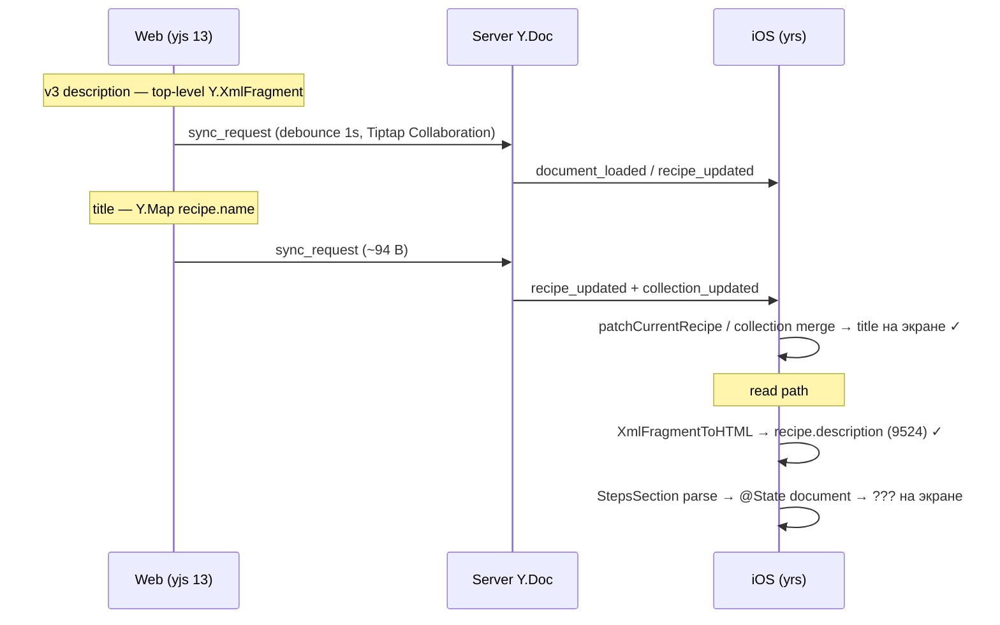

# Web ↔ Native sync: описание v3-рецепта не совпадает с вебом

Документ для handoff. Рецепт-песочница: **«Баскский чизкейк»**  
`recipeId`: `7daed53b-5e79-42e8-bd9a-bc74deea712d`  
`userId`: `cfcd839f-56f2-4411-9632-7795b75f96d1`  
Production API: `https://recipe-scaler.ru`

---

## Симптом

1. На **вебе** пересоздали описание v3-рецепта, добавили новую фразу.
2. **Новое окно браузера** (чистый логин) после синка показывает фразу → **на сервере данные корректны**.
3. На **iOS** после пересборки:
   - **Название** рецепта обновляется (live `recipe_updated` ~94–114 B).
   - **Текст описания** на экране не совпадает с вебом («рецепт не тот»).
4. Отдельная ось (ранее): правки **native → web** ломали Y.Doc на вебе из‑за `html-push` >2 KB.

---

## Что подтверждено runtime-логами (`sync-1.txt`)

### Сервер и native read path — OK

| Событие | Значение |
|---------|----------|
| `document_loaded` | **175 429–175 445 B** (полный snapshot с сервера) |
| `Replaced doc … from server snapshot` | применяется без ошибок |
| `map_read_done` / `xmlLen` | **9524** (стабильно после load) |
| `description_rendered` | `htmlLen: 9524`, `linkCountInHtml: 3`, `hasHref: true` |
| `recipe_refreshed` | `descriptionLen: 9524`, `refreshSuspended: 0` |
| `apply_update_failed` | **нет** |
| Live `recipe_updated` в сессии | только **94–95 B** (смена title в collection/recipe map) |

### Эволюция по сессиям

| Сессия | SQLite до `load_document` | После `document_loaded` | Вывод |
|--------|---------------------------|-------------------------|--------|
| Ранняя | 31 035 B, `xmlLen` **7769**, 2 ссылки | 175 038 B, `xmlLen` **9524** | Stale-first: UI мог показать 7769 до прихода сервера |
| Последняя | 34 732 B, `xmlLen` **9524**, 3 ссылки | 175 445 B, `xmlLen` **9524** | SQLite уже свежий; модель = сервер, UI всё равно «не тот» |

### Контрольный тест пользователя

**Новый браузер + логин + ожидание синка → фраза видна.**  
→ Гипотеза «веб local ahead of server» **отклонена**. Проблема не в том, что веб не flush'ит на сервер.

---

## Гипотезы

| ID | Гипотеза | Вердикт | Evidence |
|----|----------|---------|----------|
| H1 | `recipe_updated` с дельтой описания не доходит до native | **PARTIAL** | За сессию только title (~94 B); описание должно приходить через `document_loaded`, не live |
| H2 | Native не обновляет `currentRecipe` / UI model | **REJECTED** | `recipe_refreshed`, `descriptionLen: 9524` после каждого события |
| H3 | `XmlFragmentToHTML` / yrs не читает fragment | **REJECTED** | После full replace стабильно 9524, 3 ссылки |
| H4 | Stale SQLite vs сервер | **REJECTED** (последняя сессия) | SQLite уже 9524 до открытия карточки |
| H5 | Сервер отстаёт от веба | **REJECTED** | Второй браузер видит новое описание |
| H6 | Native не применяет `document_loaded` | **REJECTED** | `Replaced doc`, чтение сразу после replace |
| **H7** | **UI read-only описания не перерисовывается при смене HTML** | **LIKELY (не до конца доказано логами UI)** | Title: `Text(recipe?.name)` обновляется; описание: `StepsSection` → `@State document` + `.task(id: htmlContent)`; в логах **нет** `steps_section_parsed` |
| H8 | `RecipeDescriptionBlock.id` = случайный UUID → `ForEach` залипает при смене контента | **PLAUSIBLE** | Блоки получают новый UUID при каждом parse; при похожей структуре SwiftUI может не обновить subtree |
| H9 | Native → web ломает Y.Doc (`html-push` ~14 KB) | **CONFIRMED (другая ось)** | Guard `outbound > 2048` → drop; симулятор: `dropped_oversized_webview_update` |

---

## Архитектура: почему title и description ведут себя по-разному



**Веб:** для v3 `updateRecipe({ description })` **пропускает** описание — его пишет только Collaboration/Tiptap в `Y.XmlFragment` (`use-yjs-sync.ts`).

**Native read:** `DocumentManager.readRecipeData` → `XmlFragmentToHTML` → `recipe.description`.

**Native UI (read-only):** `YDocRecipeDetailView` → `StepsSection(htmlContent: description)` → `.task(id: htmlContent) { document = parse(...) }` → `RecipeDescriptionView(ForEach(document.blocks))`.

Файлы:

- `RecipeScalerNative/Services/YjsSync/YjsSyncService.swift` — sync, `loadRecipe`, `handleDocumentLoaded`, `refreshCurrentRecipe`
- `RecipeScalerNative/Services/YjsSync/DocumentManager.swift` — `replaceDocument`, `readRecipeData`, `applyDescriptionEditorUpdate`
- `RecipeScalerNative/Utils/XmlFragmentToHTML.swift` — yrs → HTML
- `RecipeScalerNative/Views/YDocRecipeDetailView.swift` — экран рецепта
- `RecipeScalerNative/Views/RecipeDetailView.swift` — `StepsSection`
- `RecipeScalerNative/Utils/RecipeDescriptionParser.swift` — HTML → blocks (UUID id на блок)
- `RecipeScalerNative/Resources/DescriptionEditor/description-editor-bridge.js` — WebView editor, yjs 14, `html-push`

---

## Что уже сделано (без коммита в момент написания)

1. **yjs 14** в WebView (`scripts/build-yjs-bundle.mjs`, `description-editor-bridge.js`) — совместимость с v3 XmlFragment на yrs.
2. **Debug-логирование** под симулятор/устройство:
   - `AgentSyncDebugLog` → `Library/Application Support/debug-session.ndjson`
   - `CursorDebugIngestLog` (session `d19d57`) — делегат в AgentSyncDebugLog
   - Bridge: `debugIngest()` → Swift
   - Pull: `source scripts/sim-verify-lib.sh && sim_pull_debug_log`
3. **Защита native→web:** `DocumentManager.applyDescriptionEditorUpdate` — если outbound **> 2048 B**, не слать на сервер (`dropped_oversized_webview_update`); локально `applyLocalUpdate` всё ещё применяется.
4. **DEBUG-симуляция ввода:** `-DescriptionEditorSimulateText=.` в `DebugLaunchOptions.swift`; `scripts/verify-description-editor.sh`.
5. **Инструментация sync-path:** `document_loaded`, `recipe_updated_received`, `description_rendered`, `recipe_refreshed` (hypothesisId H1–H5).

**Сознательно не делали:** починку «сломанных» Y.Doc на сервере (пересоздают рецепты); финальный UI-fix до подтверждения H7/H8.

---

## Рекомендуемые следующие шаги

### 1. Подтвердить H7 (UI) — ~15 мин

Добавить лог в `StepsSection.task(id: htmlContent)`:

- `htmlLen`, `blockCount`, optional `htmlPrefix` (первые 80 символов)
- Сравнить: после `recipe_refreshed descriptionLen=9524` приходит ли повторный parse с тем же `htmlLen`.

### 2. Исправление UI (если H7 подтверждена)

Минимальные варианты (можно комбинировать):

- Парсить синхронно в `body` или убрать `@State document` — всегда derive from `htmlContent`.
- `.id(htmlContent.count)` или stable hash на `StepsSection` / `RecipeDescriptionView`.
- **Stable block ids** в `RecipeDescriptionParser` (hash от content/path), не `UUID()` на каждый parse.

### 3. Native → web (отдельная задача)

Заменить full `html-push` на **incremental Yjs edits** в bridge; иначе правки из нативки >2 KB не доходят до сервера (guard).

### 4. Проверка после фикса

1. Веб: изменить описание (уникальная строка), подождать ≥3 с.
2. iOS: открыть рецепт, подождать 5 с на экране.
3. iOS: изменить только title — убедиться, что описание тоже актуально.
4. Логи: `descriptionLen` / `steps_section_parsed` совпадают с вебом.

---

## Команды и артефакты

```bash
# Сборка
rtk xcodebuild -scheme RecipeScalerNative \
  -destination 'platform=iOS Simulator,id=<UDID>' build

# Verify description editor (симулятор)
bash scripts/verify-description-editor.sh 7daed53b-5e79-42e8-bd9a-bc74deea712d

# Логи с устройства/симулятора
source scripts/sim-verify-lib.sh && sim_pull_debug_log
grep -E 'recipe_updated|document_loaded|description_rendered|recipe_refreshed|dropped_oversized' .debug-session.ndjson
```

| Файл | Назначение |
|------|------------|
| `sync-1.txt` | Xcode console / device log (последние прогоны) |
| `.cursor/debug-d19d57.log` | NDJSON debug session (если ingest активен) |
| `specs/019-recipe-description-inline-edit/` | inline edit feature |

---

## Краткий вердикт для коллеги

**Sync и сервер в порядке.** Native **читает** с сервера описание длиной **9524** и кладёт в `currentRecipe`. Пользователь видит другое — с высокой вероятностью баг в **read-only UI** (`StepsSection` / `ForEach` по UUID-блокам), а не в Socket.IO / `document_loaded` / yrs.

Title обновляется, потому что идёт другим путём (collection + `Text(name)`), без HTML-parser pipeline.

---

*Документ составлен: 2026-06-11. Debug session id: `d19d57`.*
